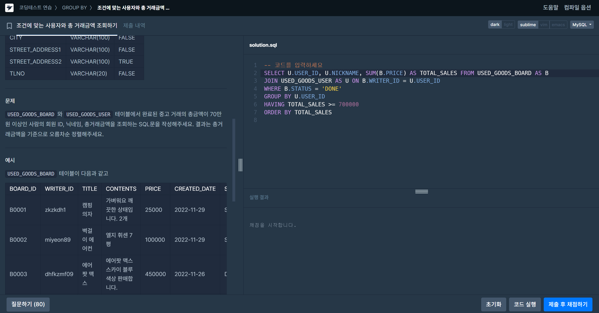

# advanced 3주차
## 1. 조건에 맞는 사용자와 총 거래금액 조회하기
### 문제
```
USED_GOODS_BOARD 테이블은 다음과 같으며 BOARD_ID, WRITER_ID, TITLE, CONTENTS, PRICE, CREATED_DATE, STATUS, VIEWS는 게시글 ID, 작성자 ID, 게시글 제목, 게시글 내용, 가격, 작성일, 거래상태, 조회수를 의미합니다.

USED_GOODS_USER 테이블은 다음과 같으며 USER_ID, NICKNAME, CITY, STREET_ADDRESS1, STREET_ADDRESS2, TLNO는 각각 회원 ID, 닉네임, 시, 도로명 주소, 상세 주소, 전화번호를 를 의미합니다.

USED_GOODS_BOARD와 USED_GOODS_USER 테이블에서 완료된 중고 거래의 총금액이 70만 원 이상인 사람의 회원 ID, 닉네임, 총거래금액을 조회하는 SQL문을 작성해주세요. 결과는 총거래금액을 기준으로 오름차순 정렬해주세요.
```

### 풀이



