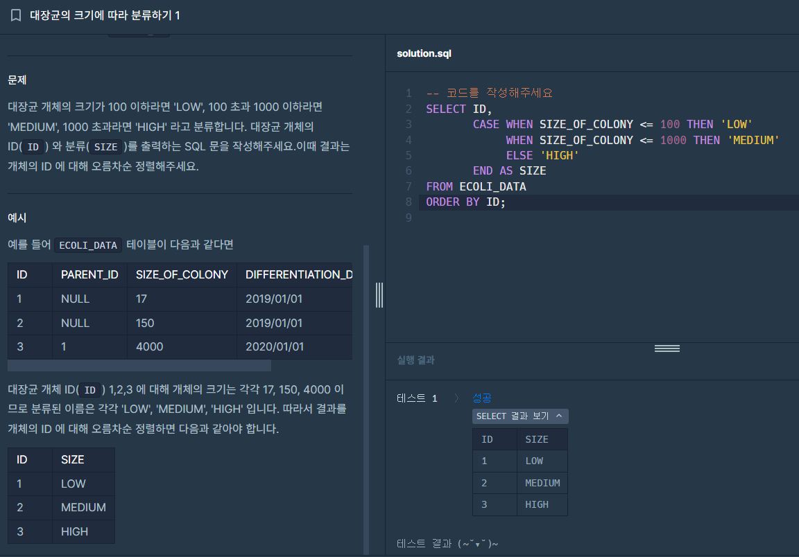
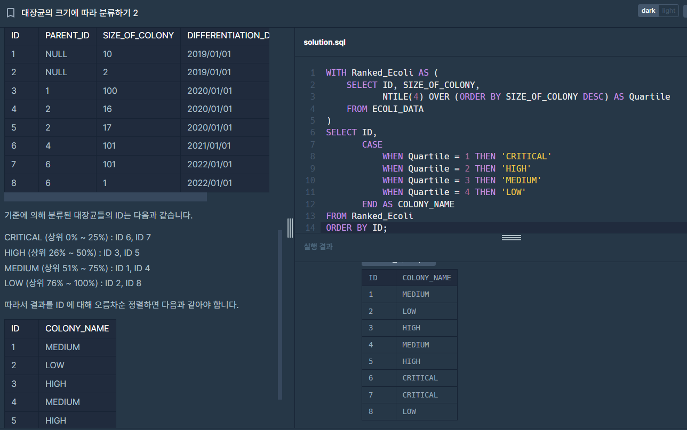
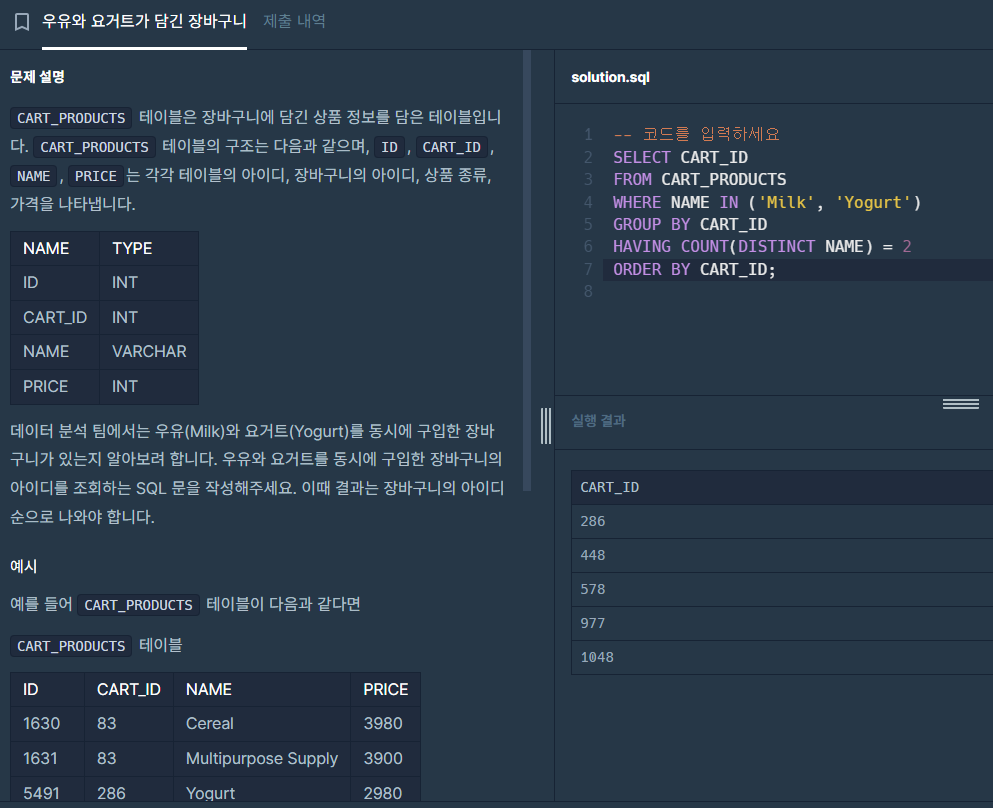
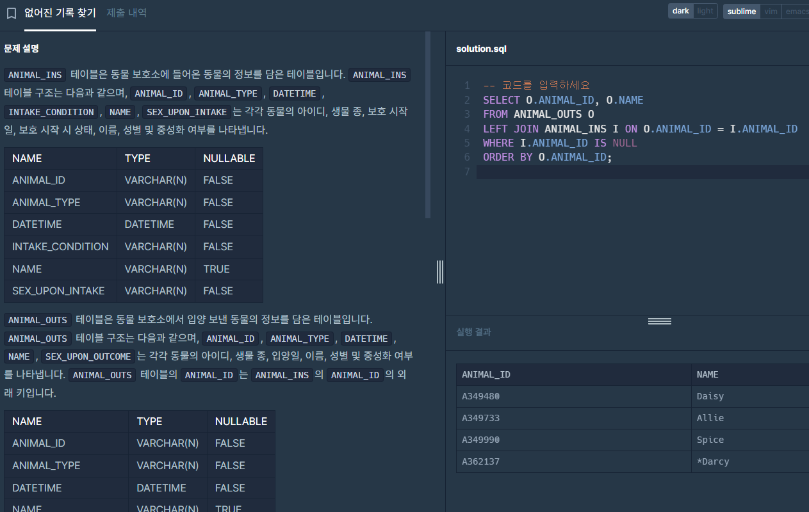
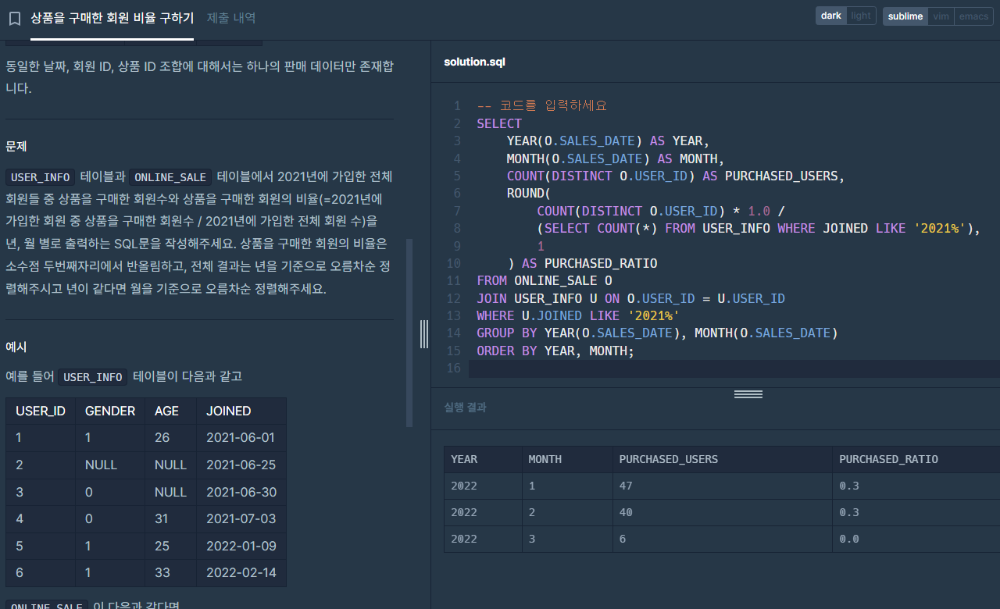

# 예리나 문제
## 1. [SELECT] 대장균의 크기에 따라 분류하기 1
### 문제
```
대장균 개체의 크기가 100 이하라면 'LOW', 100 초과 1000 이하라면 'MEDIUM', 1000 초과라면 'HIGH' 라고 분류합니다. 대장균 개체의 ID(ID) 와 분류(SIZE)를 출력하는 SQL 문을 작성해주세요.이때 결과는 개체의 ID 에 대해 오름차순 정렬해주세요.
```
### 풀이
```sql
SELECT ID,
       CASE WHEN SIZE_OF_COLONY <= 100 THEN 'LOW'
            WHEN SIZE_OF_COLONY <= 1000 THEN 'MEDIUM'
            ELSE 'HIGH'
       END AS SIZE
FROM ECOLI_DATA
ORDER BY ID;
```


## 2. [SELECT] 대장균의 크기에 따라 분류하기 2
### 문제
```
대장균 개체의 크기를 내름차순으로 정렬했을 때 상위 0% ~ 25% 를 'CRITICAL', 26% ~ 50% 를 'HIGH', 51% ~ 75% 를 'MEDIUM', 76% ~ 100% 를 'LOW' 라고 분류합니다. 대장균 개체의 ID(ID) 와 분류된 이름(COLONY_NAME)을 출력하는 SQL 문을 작성해주세요. 이때 결과는 개체의 ID 에 대해 오름차순 정렬해주세요 . 단, 총 데이터의 수는 4의 배수이며 같은 사이즈의 대장균 개체가 서로 다른 이름으로 분류되는 경우는 없습니다.
```
### 풀이
```sql
WITH Ranked_Ecoli AS (
    SELECT ID, SIZE_OF_COLONY,
           NTILE(4) OVER (ORDER BY SIZE_OF_COLONY DESC) AS Quartile
    FROM ECOLI_DATA
)
SELECT ID,
       CASE
           WHEN Quartile = 1 THEN 'CRITICAL'
           WHEN Quartile = 2 THEN 'HIGH'
           WHEN Quartile = 3 THEN 'MEDIUM'
           WHEN Quartile = 4 THEN 'LOW'
       END AS COLONY_NAME
FROM Ranked_Ecoli
ORDER BY ID;
```


## 3. 우유와 요거트가 담긴 장바구니
### 문제
```
데이터 분석 팀에서는 우유(Milk)와 요거트(Yogurt)를 동시에 구입한 장바구니가 있는지 알아보려 합니다. 우유와 요거트를 동시에 구입한 장바구니의 아이디를 조회하는 SQL 문을 작성해주세요. 이때 결과는 장바구니의 아이디 순으로 나와야 합니다.
```
### 풀이
```sql
SELECT CART_ID
FROM CART_PRODUCTS
WHERE NAME IN ('Milk', 'Yogurt')
GROUP BY CART_ID
HAVING COUNT(DISTINCT NAME) = 2
ORDER BY CART_ID;
```


## 4. [JOIN] 없어진 기록 찾기
### 문제
```
천재지변으로 인해 일부 데이터가 유실되었습니다. 입양을 간 기록은 있는데, 보호소에 들어온 기록이 없는 동물의 ID와 이름을 ID 순으로 조회하는 SQL문을 작성해주세요.
```
### 풀이
```sql
SELECT O.ANIMAL_ID, O.NAME
FROM ANIMAL_OUTS O
LEFT JOIN ANIMAL_INS I ON O.ANIMAL_ID = I.ANIMAL_ID
WHERE I.ANIMAL_ID IS NULL
ORDER BY O.ANIMAL_ID;
```


## 5. [JOIN] 상품을 구매한 회원 비율 구하기
### 문제
```
USER_INFO 테이블과 ONLINE_SALE 테이블에서 2021년에 가입한 전체 회원들 중 상품을 구매한 회원수와 상품을 구매한 회원의 비율(=2021년에 가입한 회원 중 상품을 구매한 회원수 / 2021년에 가입한 전체 회원 수)을 년, 월 별로 출력하는 SQL문을 작성해주세요. 상품을 구매한 회원의 비율은 소수점 두번째자리에서 반올림하고, 전체 결과는 년을 기준으로 오름차순 정렬해주시고 년이 같다면 월을 기준으로 오름차순 정렬해주세요.
```
### 풀이
```sql
SELECT 
    YEAR(O.SALES_DATE) AS YEAR,
    MONTH(O.SALES_DATE) AS MONTH,
    COUNT(DISTINCT O.USER_ID) AS PURCHASED_USERS,
    ROUND(
        COUNT(DISTINCT O.USER_ID) * 1.0 / 
        (SELECT COUNT(*) FROM USER_INFO WHERE JOINED LIKE '2021%'), 
        1
    ) AS PURCHASED_RATIO
FROM ONLINE_SALE O
JOIN USER_INFO U ON O.USER_ID = U.USER_ID
WHERE U.JOINED LIKE '2021%'
GROUP BY YEAR(O.SALES_DATE), MONTH(O.SALES_DATE)
ORDER BY YEAR, MONTH;
```

