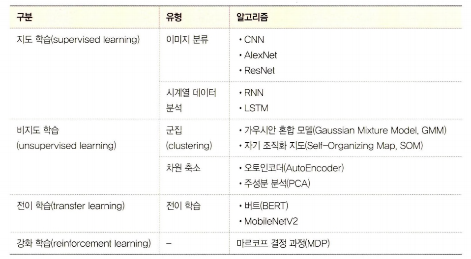
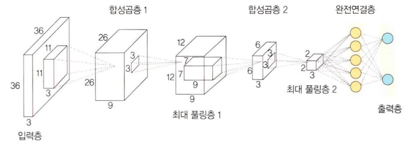

# 1장. 머신 러닝과 딥러닝

## 1.1 인공지능, 머신 러닝과 딥러닝

**인공지능 > 머신 러닝 > 딥러닝**


- 머신 러닝 : 주어진 데이터를 인간이 전처리. 범용적인 목적을 위해 제작된 것으로 **데이터의 특징을 스스로 추출하지 못함**. → 전처리 필요. 각 데이터 특성을 컴퓨터에 인식시키고 학습시켜 문제 해결.
- 딥러닝 : **인간이 하던 작업 생략**. 대량의 데이터를 신경망에 적용하면 컴퓨터가 스스로 분석한 후 답을 찾음.


## 1.2 머신 러닝이란

### 1.2.1 머신 러닝 학습 과정


- 크게 학습 단계와 예측 단계로 구분됨.
- 데이터 : 머신 러닝이 학습 모델을 만드는 데 사용. 특성을 잘 반영하기 위해서는 실제 데이터의 특징이 잘 반영되고 편향되지 않는 훈련 데이터를 확보해야 함. ‘훈련 데이터셋’과 ‘검증 데이터셋’으로 분리해서 사용하기도 함.(8:2로 split하는 것이 일반적)
- 모델 : 머신 러닝의 학습 단계에서 얻은 최종 결과물. 가설이라고도 함. **“입력 데이터의 패턴은 A와 같다.”라는 가정을 머신 러닝에서는 모델이라고 함.**

> 모델 = 우리가 데이터 관계를 설명하기 위해 세운 함수이므로, “이런 구조로 설명될 것이다.”라는 가설을 세운 후, 시험해 보고 검증하는 과정의 산물이기 때문.
> 
1. 모델(또는 가설) 선택
2. 모델 학습 및 평가
3. 평가를 바탕으로 모델 업데이트
- 훈련 데이터셋에 대한 정확도는 높은데 검증 데이터셋에 대한 정확도가 낮음 → 훈련 데이터셋에 과적합. → 정규화 or 에포크를 줄이는 방식으로 방지.

### 1.2.2 머신 러닝 학습 알고리즘

- **지도 학습 :** 정답이 무엇인지 컴퓨터에 알려주고 학습시키는 방법.
- **비지도 학습** : 정답을 알려주지 않고 특징이 비슷한 데이터를 클러스터링하여 예측하는 학습 방법.


- **강화 학습 :** 분류할 수 있는 데이터가 있는 것도 아니고 데이터가 있다고 해도 정답이 없기 때문. 강화 학습은 자신의 행동에 대한 보상을 받으며 학습을 진행함. 강화 학습은 이러한 보상이 커지는 행동은 자주 하도록 하고, 줄어드는 행동은 덜 하도록 하여 학습을 진행함.

### 1.3.1 딥러닝 학습 과정

1. 데이터 준비 : 파이토치, 케라스 / 캐글
2. 모델(모형) 정의 : 은닉층 개수가 많을수록 성능이 좋아지지만, 과적합이 발생할 확률이 높음. 
3. 모델(모형) 컴파일 : 활성화 함수, 손실 함수, 옵티마이저를 선택함.

훈련 데이터셋 형태가 연속형 ⇒ 평균 제곱 오차(MSE)

이진 분류 ⇒ 크로스 엔트로피(두 확률 분포 간의 차이를 정량화하는 지표로, 머신러닝에서는 주로 **실제 분포**와 **모델이 예측한 분포**의 차이를 평가하는 손실 함수)

1. 모델(모형) 훈련 : 한 번에 처리할 데이터양 지정. ← 에포크 선택. 파라미터와 하이퍼마라미터에 대한 최적의 값을 찾을 수 있어야 함.
2. 모델(모형) 예측 : 검증 데이터셋을 생성한 모델(모형)에 적용하여 실제로 예측을 진행해 보는 단계. 예측력이 낮다면 파라미터를 튜닝, 신경망 자체를 재설계.
- 역전파 : 가중치 값을 업데이트 하기 위해.


### 1.3.2 딥러닝 학습 알고리즘

**<지도 학습>**
- 합성곱 신경망(CNN) : 컴퓨터 비전에 많이 사용됨. 목적에 따라 이미지 분류, 이미지 인식, 이미지 분할로 분류됨.
- 순환 신경망(RNN) : 시계열 데이터를 분류할 때 사용됨. 역전파 과정에서 기울기 소멸 문제가 발생하는 단점이 있음.
- LSTM : RNN이 가지고 있는 문제점을 개선하고자 게이트 세 개를 추가. 망각 게이트, 입력 게이트, 출력 게이트 도입을 통해 기울기 소멸 문제 해결.

**<비지도 학습>**
- 워드 임베딩 : 단어를 벡터로 표현. 워드투벡터, 글로브 많이 사용.
- 군집 : 아무런 정보가 없는 상태에서 데이터를 분류하는 방법. 머신 러닝의 군집과 다르지 않음. 머신 러닝에서 군집화를 처리할 때 딥러닝과 함께 사용하면 모델 성능을 높일 수 있기 때문에 딥러닝과 함께 사용하면 좋음.

**<전이 학습>**\
사전에 학습이 완료된 모델을 가지고 우리가 원하는 학습에 미세 조정 기법을 이용하여 학습시키는 방법.

**<사전 학습 모델>**\
풀고자 하는 문제와 비슷하면서 많은 데이터로 이미 학습이 되어 있는 모델. VGG, 인셉션, MoblieNet 같은 사전 학습 모델을 사용하면 효율적 학습 가능.


---

# 2장. 실습 환경 설정과 파이토치 기초

## 2.1 파이토치 개요

- 넘파이를 대체하면서 GPU를 이용한 연산이 필요한 경우
- 최대한의 유연성과 속도를 제공하는 딥러닝 연구 플랫폼이 필요한 경우

> 간결하고 빠른 구현성

### 2.1.1 파이토치 특징 및 장점

**GPU에서 텐서 조작 밑 동적 신경망 구축이 가능한 프레임워크**

- GPU : 연산 속도를 빠르게 하는 역할.
- 텐서 : 파이토치의 데이터 형태. 단일 데이터 형식으로 된 자료들의 다차원 행렬. GPU로 연산을 수행하게 할 수 있음.

```python
import torch
torch.tensor([[1., -1.], [1., -1.]])
```


- 동적 신경망 : 훈련을 반복할 때마다 네트워크 변경이 가능한 신경망. 학습 중 은닉층을 추가하거나 제거하는 등 모델의 네트워크 조작 가능. 연산 그래프를 정의하는 것과 동시에 값도 초기화되는 ‘Define by Run’방식을 사용함. 연산 그래프와 연산을 분리해서 생각할 필요가 없음 → 코드를 이해하기 쉬움.


### 2.1.2 파이토치의 아키텍처
](../img/멘멘/1주차/10.png)

- **파이토치 API**

사용자 인터페이스 제공. 실제 계산을 수행하진 않음. C++로 작성된 파이토치 엔진으로 그 작업을 전달하는 역할을 함.

```
torch : GPU를 지원하는 텐서 패키지
torch. autograd : 자동 미분 패키지
torch.nn : 신경망 구축 및 훈련 패키지
torch.multiprocessing : 파이썬 멀티프로세싱 패키지
torch.utils : DataLoader 및 기타 유틸리티를 제공하는 패키지
```

- **파이토치 엔진**

파이토치 엔진 라이브러리는 C++로 감싼 다음 Python API 형태로 제공되기 때문에 사용자들이 손쉽게 모델을 구축하고 텐서를 사용할 수 있음.


](../img/멘멘/1주차/11.png)

- **연산 처리**

가장 아래 계층에 속하는 C 또는 CUDA 패키지는 상위의 API에서 할당된 거의 모든 계산을 수행함. 효율적인 데이터 구조, 다차원 텐서에 대한 연산을 처리함.

## 2.2 파이토치 기초 문법

### 2.2.3 모델 정의

- 계층 : 모듈 또는 모듈을 구성하는 한 개의 계층으로 합성곱층, 선형 계층 등이 있음.
- 모듈 : 한 개 이상의 계층이 모여서 구성된 것. 모듈이 모여 새로운 모듈을 만들 수 있음.
- 모델 : 최종적으로 원하는 네트워크. 한 개의 모듈이 모델이 될 수도 있음.


### 2.2.4 모델의 파라미터 정의

- 손실 함수 : 학습하는 동안 출력과 정답 사이의 오차를 측정함.

BCELoss, CrossEntropyLoss, MSELoss

- 옵티마이저 : 데이터와 손실 함수를 바탕으로 모델의 업데이트 방법을 결정.

step() 메서드를 통해 전달받은 파라미터를 업데이트함.

모델의 파라미터별로 다른 기준을 적용시킬 수 있음.

- 학습률 스케줄러 : 미리 지정한 횟수의 에포크를 지날 때마다 학습률을 감소시켜 줌. 학습 초기에는 빠른 학습을 진행하다가 전역 최소점 근처에 다다르면 학습률을 줄여서 최적점을 찾아갈 수 있도록 해 줌.

](../img/멘멘/1주차/13.png)

- 지표 : 훈련과 테스트 단계를 모니터링함.

### 2.2.5 모델 훈련

y=wx+b라는 함수에서 w와 b의 적절한 값을 찾는 것과 같음. w와 b에 임의의 값을 적용하여 시작하며 오차가 줄어들어 전역 최소점에 이를 때까지 파라미터(w, b)를 계속 수정함.

1. otimizer.zero.grad() 메서드를 이용하여 기울기를 초기화함.
2. loss.backward() 메서드를 이용하여 기울기를 자동 계산함.


### 2.2.6 모델 평가

1. 함수
2. 모듈
3. 사이킷런을 제공하는 혼동 행렬

### 2.2.7 훈련 과정 모니터링

텐서보드를 이용하면 학습에 사용되는 각종 파라미터 값이 어떻게 변화하는지 손쉽게 시각화하여 살펴볼 수 있으며 성능을 추적하거나 평가하는 용도로도 사용됨.

1. 텐서보드 설정
2. 텐서보드 기록
3. 텐서보드를 사용하여 모델 구조를 살펴봄.

## 2.3 실습 환경 설정

](../img/멘멘/1주차/15.png)

가상환경 활성화!

## 2.4 파이토치 코드 맛보기

https://github.com/e-jungs2/Today-I-learned/blob/main/BOAZ/%EB%A9%98%EB%A9%98/1%EC%A3%BC%EC%B0%A8.ipynb

<성능 평가 지표>

- True Postive : 모델이 ‘1’이라고 예측했는데 실제 값도 ‘1’인 경우
- True Negative : 모델이 ‘0’이라고 예측했는데 실제 값도 ‘0’인 경우
- False Postive : 모델이 ‘1’이라고 예측했는데 실제 값은 ‘0’인 경우, 제 1종 오류
- False Negative : 모델이 ‘0’이라고 예측했는데 실제 값은 ‘1’인 경우, 제 2종 오류

**정확도** : 전체 예측 건수에서 정답을 맞힌 건수의 비율

$$
\mathrm{Accuracy}
= \frac{\text{True Positive} + \text{True Negative}}
       {\text{True Positive} + \text{True Negative} + \text{False Positive} + \text{False Negative}}

$$

**재현율** : 실제로 정답이 1이라고 할 때 모델도 1로 예측한 비율. 처음부터 데이터가 1일 확률이 적을 때 사용.

$$
\mathrm{재현율}= \frac{\text{True Positive}}       {\text{True Positive} + \text{False Positive}}
$$

**정밀도** : 모델이 1이라고 예측한 것 중에서 실제로 정답이 1인 비율.

$$
\mathrm{재현율}= \frac{\text{True Positive}}       {\text{True Positive} + \text{False Negative}}
$$

**F1-스코어** : 정밀도와 재현율은 트레이드오프 관계. 이런 문제를 해결하려고 정밀도와 재현율의 조화 평균을 이용한 것이 F1-스코어.

$$
\mathrm{F1\text{-}스코어}= \frac{2 \times  \mathrm{Precision} \times \mathrm{Recall}}       {\mathrm{Precision} + \mathrm{Recall}}
$$

---

# 3장. 머신 러닝 핵심 알고리즘

## 3.1 지도 학습

정답을 컴퓨터에 미리 알려주고 데이터를 학습시키는 방법. 

- 분류 : 주어진 데이터를 정해진 범주에 따라 분류.
- 회귀 : 데이터들의 특성을 기준으로 연속된 값을 그래프로 표현하여 패턴이나 트렌드 예측.


### 3.1.1 K-최근접 이웃
새로운 입력을 받았을 때 기존 클러스터에서 모든 데이터와 인스턴스 기반 거리를 측정한 후 가장 많은 속성을 가진 클러스터에 할당하는 분류 알고리즘. 과거의 데이터를 사용하여 미리 분류 모형을 만드는 것이 아니라, 과거 데이터를 저장해 두고 필요할 때마다 비교를 수행하는 방식. K 값의 선택에 따라 분류 결과가 달라짐.


>**새로운 입력 1** : 주변 범주 세 개가 주황색이므로 주황색으로 분류.\
**새로운 입력 2** : 주변 범주 두 개가 주황색, 한 개가 녹색이므로 주황색으로 분류.\
**새로운 입력 3** : 주변 범주 두개가 녹색, 한 개가 주황색이므로 녹색으로 분류.

### 3.1.2 서포트 벡터 머신(SVM)

분류를 위한 기준선을 정의하는 모델. 분류되지 않은 새로운 데이터가 나타나면 결정 경계(기준선)를 기준으로 경계의 어느 쪽에 속하는지 분류하는 모델.


**마진** : 결정 경계와 서포트 벡터 사이의 거리를 의미함. 서포트 벡터는 결정 경계와 가까이 있는 데이터들을 의미함. → 최적의 결정 경계 : 마진 최대.

>마진을 최대화하기 위해선 이상치를 잘 다루는 것이 중요. 이상치를 허용하지 않는 것을 하드 마진이라고 하며, 어느 정도의 이상치들이 마진 안에 포함되는 것을 허용하면 소프트 마진.

### 3.1.3 결정 트리

데이터를 분류하거나 결과값을 예측하는 분석 방법.결정트리는 데이터를 1차로 분류 후, 각 영역의 순도는 증가하고 불순도와 불확실성은 감소하는 방향으로 학습 진행. ← 정보 획득.

### 3.1.4 로지스틱 회귀와 선형 회귀

- **로지스틱 회귀** : 분석하고자 하는 대상들이 두 집단 혹은 그 이상의 집단으로 나누어진 경우, 개별 관측치들이 어느 집단으로 분류될 수 있는지 분석하고 이를 예측하는 모형을 개발하는 데 사용되는 통계 기법.
1. 각 집단에 속하는 확률의 추정치 예측
2. 분류 기준 값을 설정한 후 특정 범주로 분류
- **선형 회귀** : 종속 변수와 독립 변수 사이의 관계를 설정하는 데 사용됨. 독립 변수가 변경되었을 때 종속 변수를 추정하는 데 유용. (x가 한 단위 올라갔을 때의 y)


## 3.2 비지도 학습

정답이 없는 상태에서 훈련시키는 방식.

- **군집** : 각 데이터의 유사성을 측정한 후 유사성이 높은 데이터끼리 집단으로 분류하는 것
- **차원 축소** : 차원을 나타내는 특성을 줄여서 데이터를 줄이는 방식.

### 3.2.1 K-평균 군집화

데이터를 입력받아 소수의 그룹으로 묶는 알고리즘.

1. 중심점 선택 : 랜덤하게 초기 중심점을 선택함.
2. 클러스터 할당 : K개의 중심점과 각각의 개별 데이터 간의 거리를 측정한 후, 가장 가까운 중심점을 기준으로 데이터를 할당. 이 과정을 통해 클러스터가 구성됨.
3. 새로운 중심점 선택 : 클러스터마다 새로운 중심점을 계산함.
4. 범위 확인 : 선택된 중심점에 더 이상의 변화가 없다면 진행을 멈춤.


> 데이터가 비선형일 때, 군집 크기가 다를 때, 군집마다 밀집도와 거리가 다를 때는 사용하지 않는 것이 좋음.


### 3.2.2 밀도 기반 군집 분석

일정 밀도 이상을 가진 데이터를 기준으로 군집을 형성하는 방법. 노이즈에 영향을 받지 않으며, K-평균 군집화에 비해 연산량은 많지만 K-평균 군집화가 잘 처리하지 못하는 오목하거나 볼록한 부분을 처리하는 데 유용함.

](../img/멘멘/1주차/24.png)

1. 엡실론 내 점 개수 확인 및 중심점 결정.
2.  군집 확장
3. 노이즈 정의

### 3.2.3 주성분 분석(PCA)

변수가 많은 고차원 데이터의 경우 중요하지 않은 변수로 처리해야 할 데이터양이 많아지고 성능 또한 나빠지는 경향이 있음. → 고차원 데이터를 저차원으로 축소 시키는 알고리즘인 주성분 분석으로 해결.

1. 데이터들의 분포 특성을 잘 설명하는 벡터를 두 개 선택
2. 벡터 두 개를 위한 적정한 가중치를 찾을 때까지 학습을 진행

---

# 4장. 딥러닝 시작

## 4.1 인공 신경망의 한계와 딥러닝 출현

- AND 게이트
- OR 게이트
- XOR 게이트

## 4.2 딥러닝 구조!


- 입력층
- 두 개 이상의 은닉층
- 출력층
- 가중치 : 가중치는 입력 값이 연산 결과에 미치는 영향력을 조절하는 요소.


- 가중합 또는 전달 함수 : 각 노드에서 들어오는 신호에 가중치를 곱해서 다음 노드로 전달되는데, 이 값들을 모두 더한 합계를 가중합이라고 함.


### 4.2.2 딥러닝 학습

1. 순전파

입력 데이터가 입력층→은닉층→출력층 순서로 전달되며, 각 층의 뉴런은 이전 층에서 받은 신호에 가중치(weight)와 활성화 함수(activation)를 적용해 출력값을 계산함. 마지막 출력층에서 나온 예측값과 실제 정답 사이의 차이를 손실함수(loss function)로 측정함.

1. 역전파

출력층에서 계산된 손실(오차)을 네트워크 반대 방향으로 전파하며, 각 층·뉴런의 가중치가 손실에 어느 정도 기여했는지(손실의 기울기, gradient)를 구함. 이 기울기를 이용해 가중치를 조금씩 조정(gradient descent)해 손실이 점점 0에 가까워지도록 학습함.

### 4.2.3 딥러닝의 문제점과 해결 방안


딥러닝의 핵심을 활성화 함수가 적용된 여러 은닉층을 결합하여 비선형 영역을 표현하는 것. → 은닉층 개수가 많은수록 데이터 분류가 잘되고 있음. 은닉층이 많을 수록 세 가지 문제점이 생김.

> 1. 과적합 문제 발생\
훈련 데이터를 과하게 학습했기 때문에 예측 값과 실제 값 차이인 오차가 감소하지만, 검증 데이터에 대해서는 오차가 증가할 수 있음.
2. 기울기 소멸 문제 발생\
은닉층이 많은 신경망에서 주로 발생. 출력층에서 은닉층으로 전달되는 오차가 크게 줄어들어 학습이 되지 않는 현상. 기울기가 소멸되기 때문에 학습되는 양이 ‘0’에 가까워져 학습이 더디게 진행되다 오차를 더 줄이지 못하고 그 상태로 수렴하는 현상. → 시그모이드, 하이퍼볼릭 탄젠트 대신 렐루 활성화 함수 사용으로 해결.
3. 성능이 나빠지는 문제 발생\
경사 하강법은 손실 함수의 비용이 최소가 되는 지점을 찾을 때까지 기울기가 낮은 쪽으로 계속 이동시키는 과정을 반복하는데, 이때 성능이 나빠짐. → 확률적 경사 하강법과 미니 배치 경사 하강법을 사용함


## 4.3 딥러닝 알고리즘

### 4.3.1 심층 신경망(CNN)

입력층과 출력층 사시에 다수의 은닉층을 포함하는 인공신경망. 다수의 은닉층을 두었기 때문에 다양한 비선형적 관계를 학습할 수 있는 장점이 있지만, 학습을 위한 연산량이 많고 기울기 소멸 문제등이 발생할 수 있음. → 드롭아웃, 렐루 함수, 배치 정규화 등으로 해결.


### 4.3.2 합성곱 신경망(CNN)

합성곱층과 풀링층을 포함하는 이미지 처리 성능이 좋은 인공 신경망 알고리즘. 영상 및 사진이 포함된 이미지 데이터에서 객체를 탐색하거나 객체 위치를 찾아네는 데 유용한 신경망.


### 4.3.3 순환 신경망(RNN)

시계열 데이터 같은 시간 흐름에 따라 변화하는 데이터를 학습하기 위한 인공 신경망. ‘순환’은 자기 자신을 참조한다는 것. ← 현재 결과가 이전 결과와 연관이 있다는 의미.


### 4.3.4 제한된 볼츠만 머신(RBM)
가시층과 은닉층으로 구성된 모델. ← 볼츠만 머신

가시층은 은닉층과 연결되는 모델 ← 제한된 볼츠만 머신.

차원 감소, 분류, 선형 회귀 분석, 협업 필터링, 특성 값 학습, 주제 모델링에 사용. 기울기 소멸 문제를 해결하기 위해 사전 학습 용도로 활용 가능. 심층 신뢰 신경망의 요소로도 활용됨.


### 4.3.5 심층 신뢰 신경망

입력층과 은닉층으로 구성된 제한된 볼츠만 머신을 블록으로 여러 층으로 쌓은 형태로 연결된 신경망. 사전 훈련된 제하노딘 볼츠만 머신을 층층이 쌓아 올린 구조. 비지도 학습도 가능.

