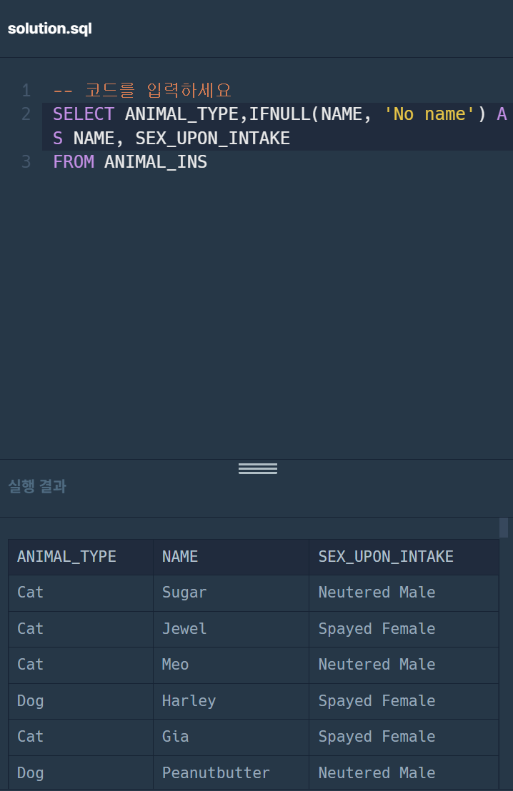
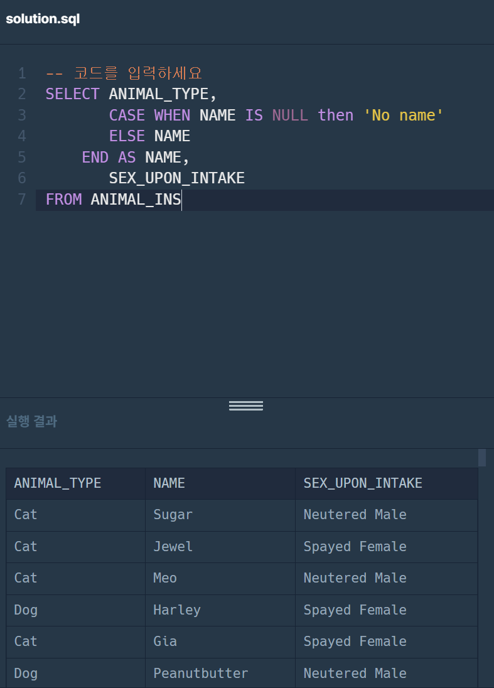
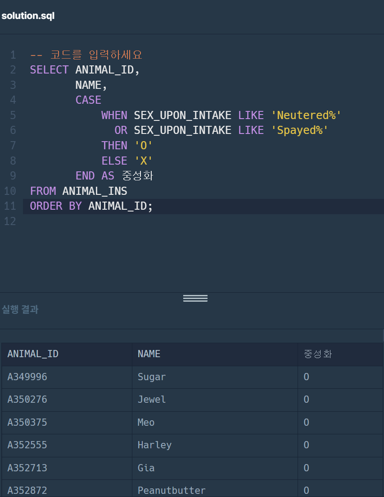

# advanced 7주차
## [ISNULL] NULL 처리하기 (SQL 고득점kit)
```
입양 게시판에 동물 정보를 게시하려 합니다. 동물의 생물 종, 이름, 성별 및 중성화 여부를 아이디 순으로 조회하는 SQL문을 작성해주세요. 이때 프로그래밍을 모르는 사람들은 NULL이라는 기호를 모르기 때문에, 이름이 없는 동물의 이름은 "No name"으로 표시해 주세요.
```
### 문제1. IFNULL로 해결

### 풀이
```sql
SELECT ANIMAL_TYPE,
IFNULL(NAME, 'No name') AS NAME,
SEX_UPON_INTAKE
FROM ANIMAL_INS
```

### 문제2. CASE WHEN으로 해결
### 풀이
```sql
SELECT ANIMAL_TYPE,
       CASE WHEN NAME IS NULL then 'No name'
       ELSE NAME
    END AS NAME, 
       SEX_UPON_INTAKE
FROM ANIMAL_INS
```


## 중성화 여부 파악하기
```
보호소의 동물이 중성화되었는지 아닌지 파악하려 합니다. 중성화된 동물은 SEX_UPON_INTAKE 컬럼에 'Neutered' 또는 'Spayed'라는 단어가 들어있습니다. 동물의 아이디와 이름, 중성화 여부를 아이디 순으로 조회하는 SQL문을 작성해주세요. 이때 중성화가 되어있다면 'O', 아니라면 'X'라고 표시해주세요.
```

### 문제3. 문제를 풀어주세요 (힌트 : IF, LIKE를 사용할 수 있습니다)
### 풀이이
```sql
SELECT ANIMAL_ID,
       NAME,
       CASE 
           WHEN SEX_UPON_INTAKE LIKE 'Neutered%' 
             OR SEX_UPON_INTAKE LIKE 'Spayed%' 
           THEN 'O'
           ELSE 'X'
       END AS 중성화
FROM ANIMAL_INS
ORDER BY ANIMAL_ID
```


<오류 코드>
```sql
SELECT animal_id, name,
       if (sex_upon_intake like '%Neutered%' or '%Spayed%', 'O' , 'X') as '중성화'
from animal_ins
order by 1
```
<설명>
1. IF 함수 사용 오류
IF 함수는 IF(..., ..., ...) 이런 식임. OR 연산자는 각 조건에 대해 개별적으로 써야함.
2. LIKE 연산자 오류
%Spayed% 앞에 컬럼 명이 없음. 컬럼 명을 각각 써야함.
3. 작은 따옴표가 아니라 백틱 or 그냥 컬럼명 표기