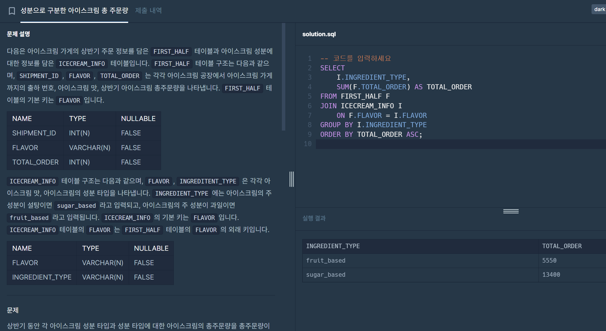
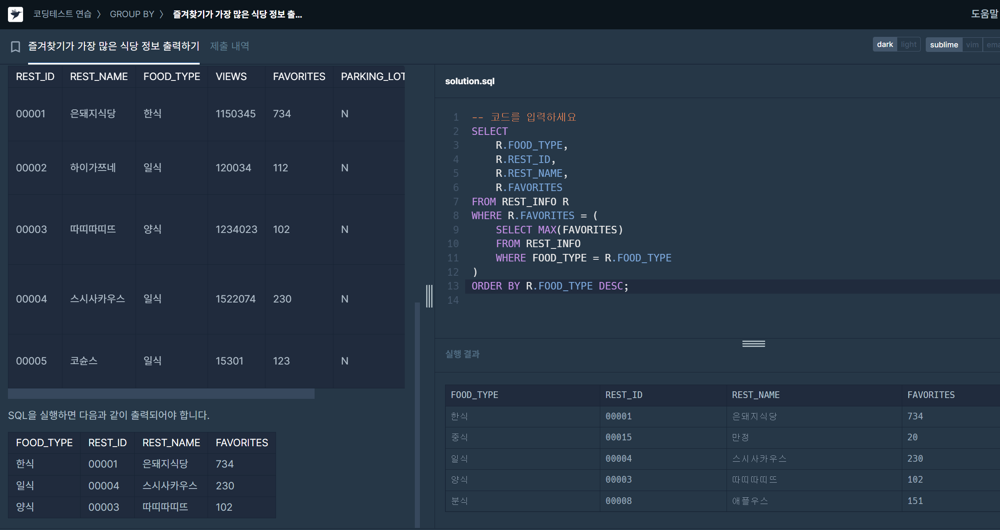
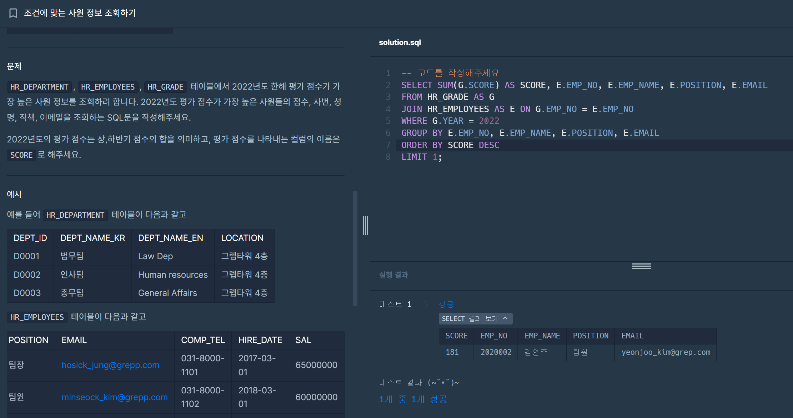

# advanced 5주차
## 1. 성분으로 구분한 아이스크림 총 주문량
### 문제
```
다음은 아이스크림 가게의 상반기 주문 정보를 담은 FIRST_HALF 테이블과 아이스크림 성분에 대한 정보를 담은 ICECREAM_INFO 테이블입니다. FIRST_HALF 테이블 구조는 다음과 같으며, SHIPMENT_ID, FLAVOR, TOTAL_ORDER 는 각각 아이스크림 공장에서 아이스크림 가게까지의 출하 번호, 아이스크림 맛, 상반기 아이스크림 총주문량을 나타냅니다. FIRST_HALF 테이블의 기본 키는 FLAVOR입니다.

ICECREAM_INFO 테이블 구조는 다음과 같으며, FLAVOR, INGREDITENT_TYPE 은 각각 아이스크림 맛, 아이스크림의 성분 타입을 나타냅니다. INGREDIENT_TYPE에는 아이스크림의 주 성분이 설탕이면 sugar_based라고 입력되고, 아이스크림의 주 성분이 과일이면 fruit_based라고 입력됩니다. ICECREAM_INFO의 기본 키는 FLAVOR입니다. ICECREAM_INFO테이블의 FLAVOR는 FIRST_HALF 테이블의 FLAVOR의 외래 키입니다.

상반기 동안 각 아이스크림 성분 타입과 성분 타입에 대한 아이스크림의 총주문량을 총주문량이 작은 순서대로 조회하는 SQL 문을 작성해주세요. 이때 총주문량을 나타내는 컬럼명은 TOTAL_ORDER로 지정해주세요.
```

### 풀이
```sql
SELECT 
    I.INGREDIENT_TYPE, 
    SUM(F.TOTAL_ORDER) AS TOTAL_ORDER
FROM FIRST_HALF F
JOIN ICECREAM_INFO I 
    ON F.FLAVOR = I.FLAVOR
GROUP BY I.INGREDIENT_TYPE
ORDER BY TOTAL_ORDER ASC
```



## 2. 즐겨차기가 가장 많은 식당 정보 출력하기
### 문제
```
다음은 식당의 정보를 담은 REST_INFO 테이블입니다. REST_INFO 테이블은 다음과 같으며 REST_ID, REST_NAME, FOOD_TYPE, VIEWS, FAVORITES, PARKING_LOT, ADDRESS, TEL은 식당 ID, 식당 이름, 음식 종류, 조회수, 즐겨찾기수, 주차장 유무, 주소, 전화번호를 의미합니다.

REST_INFO 테이블에서 음식종류별로 즐겨찾기수가 가장 많은 식당의 음식 종류, ID, 식당 이름, 즐겨찾기수를 조회하는 SQL문을 작성해주세요. 이때 결과는 음식 종류를 기준으로 내림차순 정렬해주세요.
```

### 풀이
```sql
SELECT 
    R.FOOD_TYPE, 
    R.REST_ID, 
    R.REST_NAME, 
    R.FAVORITES
FROM REST_INFO R
WHERE R.FAVORITES = (
    SELECT MAX(FAVORITES)
    FROM REST_INFO
    WHERE FOOD_TYPE = R.FOOD_TYPE
)
ORDER BY R.FOOD_TYPE DESC
```


## 3. 조건에 맞는 사원 정보 조회하기
### 문제
```
HR_DEPARTMENT 테이블은 회사의 부서 정보를 담은 테이블입니다. HR_DEPARTMENT 테이블의 구조는 다음과 같으며 DEPT_ID, DEPT_NAME_KR, DEPT_NAME_EN, LOCATION은 각각 부서 ID, 국문 부서명, 영문 부서명, 부서 위치를 의미합니다.

HR_EMPLOYEES 테이블은 회사의 사원 정보를 담은 테이블입니다. HR_EMPLOYEES 테이블의 구조는 다음과 같으며 EMP_NO, EMP_NAME, DEPT_ID, POSITION, EMAIL, COMP_TEL, HIRE_DATE, SAL은 각각 사번, 성명, 부서 ID, 직책, 이메일, 전화번호, 입사일, 연봉을 의미합니다.

HR_GRADE 테이블은 2022년 사원의 평가 정보를 담은 테이블입니다. HR_GRADE의 구조는 다음과 같으며 EMP_NO, YEAR, HALF_YEAR, SCORE는 각각 사번, 연도, 반기, 평가 점수를 의미합니다.

HR_DEPARTMENT, HR_EMPLOYEES, HR_GRADE 테이블에서 2022년도 한해 평가 점수가 가장 높은 사원 정보를 조회하려 합니다. 2022년도 평가 점수가 가장 높은 사원들의 점수, 사번, 성명, 직책, 이메일을 조회하는 SQL문을 작성해주세요.

2022년도의 평가 점수는 상,하반기 점수의 합을 의미하고, 평가 점수를 나타내는 컬럼의 이름은 SCORE로 해주세요.
```

### 풀이
```sql
SELECT SUM(G.SCORE) AS SCORE, E.EMP_NO, E.EMP_NAME, E.POSITION, E.EMAIL
FROM HR_GRADE AS G
JOIN HR_EMPLOYEES AS E ON G.EMP_NO = E.EMP_NO
WHERE G.YEAR = 2022
GROUP BY E.EMP_NO, E.EMP_NAME, E.POSITION, E.EMAIL
ORDER BY SCORE DESC
LIMIT 1
```
