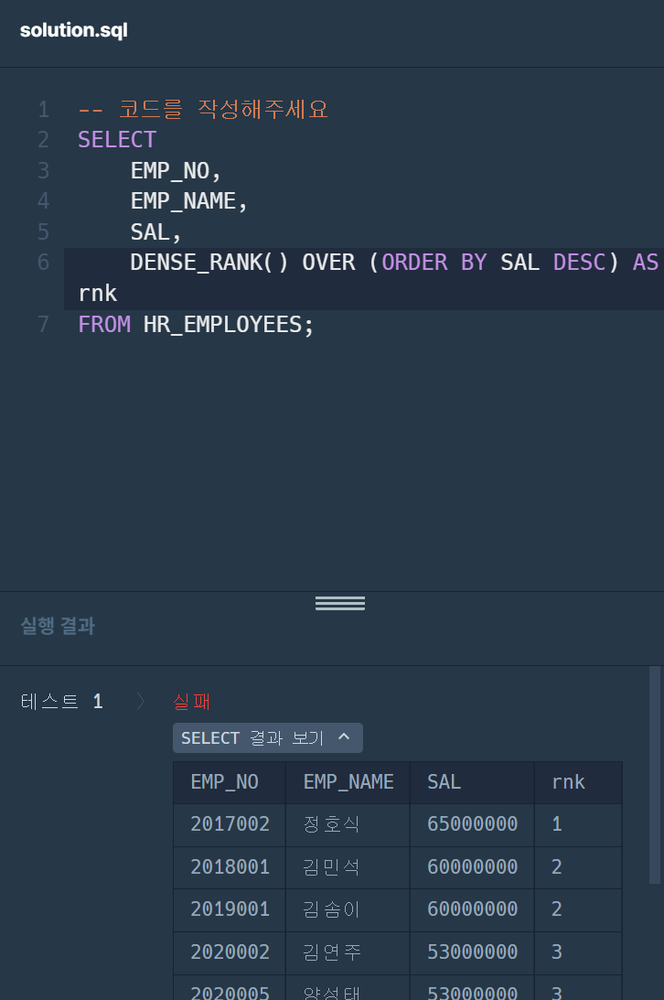
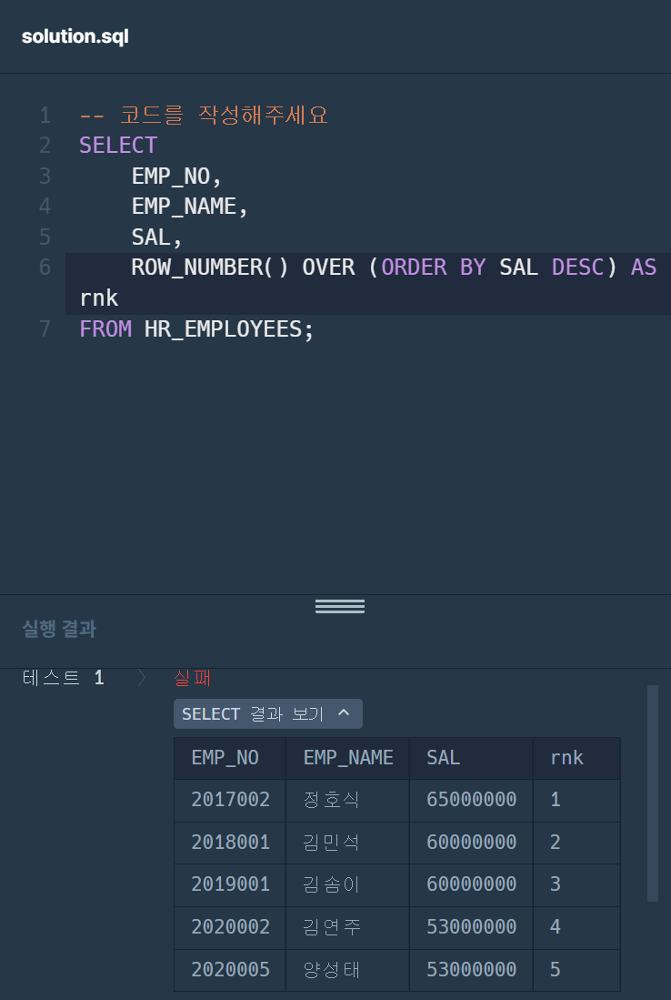

# advanced 6주차
## 1. [MAX]즐겨찾기가 가장 많은 식당 정보 출력하기
### 틀린 코드 이유 분석하기
#### 틀린 코드
```sql
SELECT *
FROM (SELECT FOOD_TYPE, REST_ID, REST_NAME, MAX(FAVORITES) AS FAVORITES
FROM REST_INFO
GROUP BY FOOD_TYPE
ORDER BY FOOD_TYPE DESC
```
#### 정답 코드
```sql
SELECT SELECT R.FOOD_TYPE, R.REST_ID, R.REST_NAME, R.FAVORITES
FROM REST_INFO AS R
WHERE FAVORITES = (
    SELECT MAX(FAVORITES)
    FROM REST_INFO
    WHERE FOOD_TYPE = R.FOOD_TYPE
)
ORDER BY R.FOOD_TYPE DESC
```
#### 틀린 코드 이유
```
1. ORDER BY
ORDER BY를 서브쿼리 내부에서 실행하는 것은 아무 의미가 없음. -> 마지막에 실행해야 함.
2. GROUP BY
FOOD_TYPE만 그룹화하면 REST_ID와 REST_NAME이 포함되지 않아 오류가 발생할 수 있음. -> 서브쿼리를 이용하여 정확한 행 필터링.
```
### 개선된 쿼리 학습
#### 개선된 쿼리
```sql
WITH RankedRest AS (
    SELECT 
        FOOD_TYPE, REST_ID, REST_NAME, FAVORITES,
        ROW_NUMBER() OVER (PARTITION BY FOOD_TYPE ORDER BY FAVORITES DESC, REST_ID) AS rnk
    FROM REST_INFO
)
SELECT 
    FOOD_TYPE, REST_ID, REST_NAME, FAVORITES
FROM RankedRest
WHERE rnk = 1
ORDER BY FOOD_TYPE DESC;
```
#### 주석
```
1. 임시 테이블을 생성하고, FOOD_TYPE별로 ROW_NUMBER()을 부여함.
2. FOOD_TYPE별로 나눠 FAVORITES가 높은 순서대로 정렬하되, 같은 FAVORITES값을 가진 경우 REST_ID 오름차순으로 정렬해 rnk로 명명함.
3. rnk=1인 행만 선택해, FOOD_TYPE을 기준으로 내림차순 정렬함.
```
- ROW_NUBER()의 장점
  - 가장 높은 FAVORITES 값이 여러 개 있어도 REST_ID 기준으로 하나만 선택 가능함.
  - 데이터셋이 클 때 성능이 더 우수함.(INDEX 최적화 가능)
  - ORDER 기준을 세부적으로 조절 가능함.

#### 이때, **RANK(), DENSE_RANK(), ROW_NUMBER() 함수**를 사용하며 결과를 비교하고 해당 함수를 사용하는 경우를 서술해주세요. (함수 사용 예제는 직접 찾아보기)
**RANK()**


**DENSE_RANK()**


**ROW_NUMBER()**


**함수 정리**

