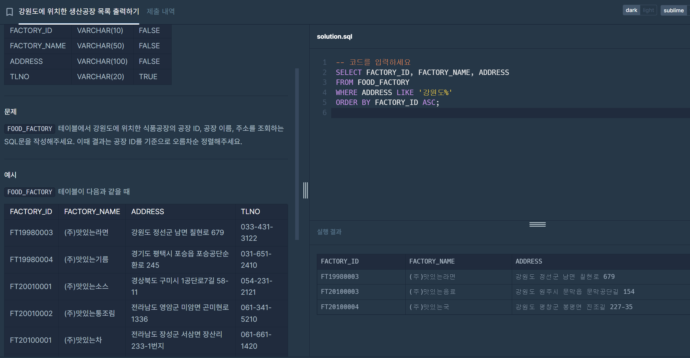
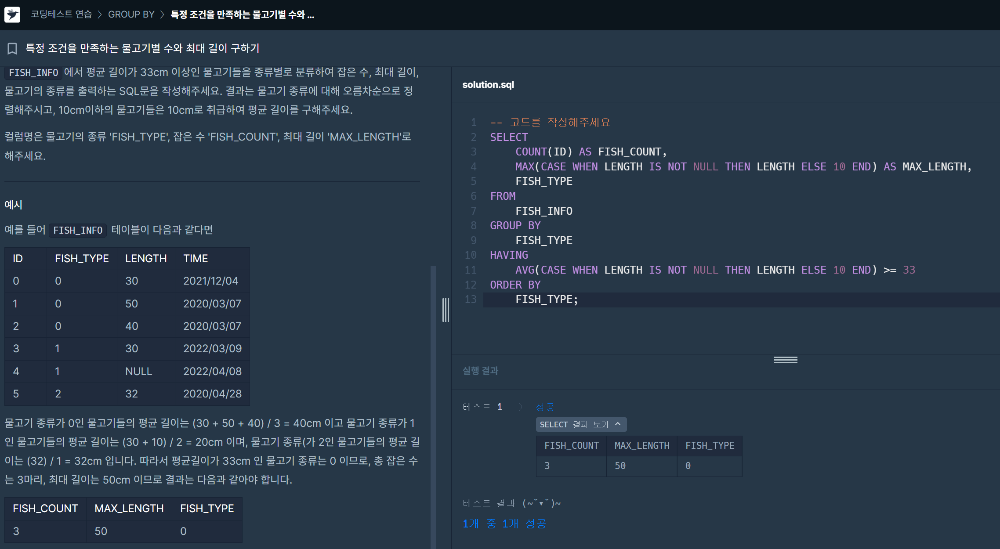
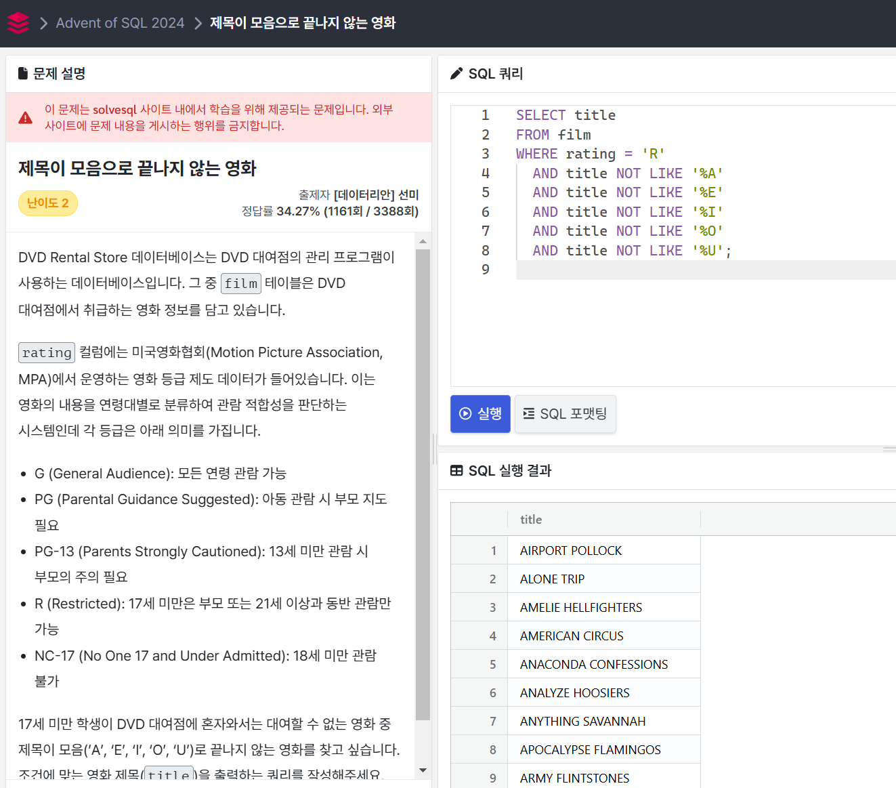

# 이젤 문제
## 강원도에 위치한 생산공장 목록 출력하기
### 문제
```
FOOD_FACTORY 테이블에서 강원도에 위치한 식품공장의 공장 ID, 공장 이름, 주소를 조회하는 SQL문을 작성해주세요. 이때 결과는 공장 ID를 기준으로 오름차순 정렬해주세요.
```
### 풀이
```sql
SELECT FACTORY_ID, FACTORY_NAME, ADDRESS
FROM FOOD_FACTORY
WHERE ADDRESS LIKE '강원도%'
ORDER BY FACTORY_ID ASC;
```

## 특정 조건을 만족하는 물고기별 수와 최대 길이 구하기
### 문제
```
FISH_INFO에서 평균 길이가 33cm 이상인 물고기들을 종류별로 분류하여 잡은 수, 최대 길이, 물고기의 종류를 출력하는 SQL문을 작성해주세요. 결과는 물고기 종류에 대해 오름차순으로 정렬해주시고, 10cm이하의 물고기들은 10cm로 취급하여 평균 길이를 구해주세요.

컬럼명은 물고기의 종류 'FISH_TYPE', 잡은 수 'FISH_COUNT', 최대 길이 'MAX_LENGTH'로 해주세요.
```
### 풀이
```sql
SELECT 
    COUNT(ID) AS FISH_COUNT,
    MAX(CASE WHEN LENGTH IS NOT NULL THEN LENGTH ELSE 10 END) AS MAX_LENGTH,
    FISH_TYPE
FROM 
    FISH_INFO
GROUP BY 
    FISH_TYPE
HAVING 
    AVG(CASE WHEN LENGTH IS NOT NULL THEN LENGTH ELSE 10 END) >= 33
ORDER BY 
    FISH_TYPE;
```


## 제목이 모음으로 끝나지 않는 영화
### 문제
```
17세 미만 학생이 DVD 대여점에 혼자와서는 대여할 수 없는 영화 중 제목이 모음(’A’, ‘E’, ‘I’, ‘O’, ‘U’)로 끝나지 않는 영화를 찾고 싶습니다. 조건에 맞는 영화 제목(title)을 출력하는 쿼리를 작성해주세요. 다른 컬럼은 출력되지 말아야 합니다.
```
### 풀이
```sql
SELECT title
FROM film
WHERE rating = 'R'
  AND title NOT LIKE '%A'
  AND title NOT LIKE '%E'
  AND title NOT LIKE '%I'
  AND title NOT LIKE '%O'
  AND title NOT LIKE '%U';
```


## 버뮤다 삼각지대에 들어가버린 택배
### 문제
```
Brazilian E-Commerce Public Dataset by Olist 데이터베이스는 브라질의 이커머스 웹사이트인 Olist Store의 판매 데이터를 담고 있습니다. 그 중 olist_orders_dataset 테이블에는 주문 ID, 고객 ID, 주문 상태, 구매 시각 등 주문 내역 데이터가 들어있습니다. Olist의 주문부터 배송까지 프로세스는 다음 단계를 통해 이루어지고, 각 단계마다 시각을 기록하고 있습니다.

고객의 구매
order_purchase_timestamp 컬럼에 구매 시점이 저장됨
판매자가 주문을 승인
order_approved_at 컬럼에 승인 시점이 저장됨
택배사에 도착하여 배송 시작
order_delivered_carrier_date 컬럼에 배송 시작 시점이 저장됨
배송 완료
order_delivered_customer_date 컬럼에 배송 완료 시점이 저장됨
종종 택배사에 물건을 보내 배송 시작이 되었는데, 고객에게 택배가 도착하지 않는 일이 있습니다. 이런 경우 order_delivered_carrier_date 컬럼에 택배사 도착 시각은 기록되지만, order_delivered_customer_date 컬럼의 값은 null으로 저장됩니다.

일단 원인을 파악하기 전에 이런 일들이 얼마나 발생하고 있는지 현황 파악을 해보려고 합니다. 2017년 1월 한 달 동안 택배사에 전달되었지만 배송 완료는 되지 않은 주문 건수를 택배사 도착일을 기준으로 집계하는 쿼리를 작성해주세요.

쿼리 결과는 택배사 도착일을 기준으로 오름차순 정렬되어야 하고, 아래 컬럼을 포함해야 합니다.

delivered_carrier_date - 택배사 도착 날짜 (예: 2017-01-16)
orders - 택배사에 도착했지만, 고객에게 배송되지 않은 주문 건 수
또한 위 서술에 해당하는 주문이 없었던 날은 출력에서 제외해주세요. 예를 들어, 2017년 1월 1일에는 택배사에 전달되었지만, 배송 완료가 되지 않은 주문은 없습니다. 이 날은 SQL 실행 결과에 포함되지 않아야 합니다.
```

### 풀이
```sql
SELECT 
    order_delivered_carrier_date AS delivered_carrier_date,
    COUNT(order_id) AS orders
FROM 
    olist_orders_dataset
WHERE 
    order_delivered_carrier_date BETWEEN '2017-01-01' AND '2017-01-31'
    AND order_delivered_customer_date IS NULL
GROUP BY 
    order_delivered_carrier_date
ORDER BY 
    delivered_carrier_date;
```
