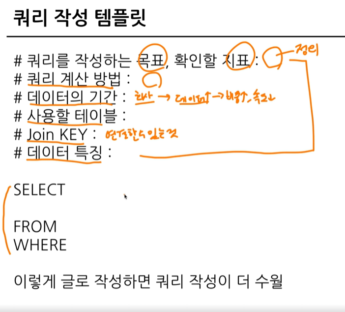

## 섹션3. 데이터 탐색 - 조건, 추출, 요약
### 2-6. 연습 문제 1-3번
#### 1. 포켓몬 중에 type2가 없는 포켓몬의 수를 작성하는 쿼리를 작성해주세요.


```js
SELECT
  COUNT (id) AS cnt
FROM basic.pokemon
WHERE
  type2 IS NULL
```

#### 2. type2가 없는 포켓몬의 type1과 type1의 포켓몬 수를 알려주는 쿼리를 작성해주세요. 단, type1의 포켓몬 수가 큰 순으로 정렬해주세요.
](<../img/3주차 과제/25.png>)
```js
SELECT
  type1,
  COUNT(id) AS pokemon_cnt
FROM basic.pokemon
WHERE
  type2 IS NULL
GROUP BY
  type1
ORDER BY
  pokemon_cnt DESC
```

#### 3. type2 상관없이 type1의 포켓몬 수를 알 수 있는 쿼리를 작성해주세요.

```js
SELECT
  type1,
  COUNT(id) AS pokemon_cnt
FROM basic.pokemon
GROUP BY
  type1
```

#### 4. 전설 여부에 따른 포켓몬 수를 알 수 있는 쿼리를 작성해주세요.

```js
SELECT
  is_legendary,
  COUNT(id) AS pokemon_cnt
FROM basic.pokemon
GROUP BY
  is_legendary
```
#### 5. 동명이인이 있는 이름은 무엇일까요?

```js
SELECT
  name,
  COUNT(name) AS trainer_cnt
FROM basic.trainer
GROUP BY
  name
HAVING
  trainer_cnt >= 2
```

#### 6. trainer 테이블에서 "Iris" 트레이너의 정보를 알 수 있는 쿼리를 작성해주세요.

```js
SELECT
  *
FROM basic.trainer
WHERE
  name = "Iris"
```

#### 7. trainer 테이블에서 "Iris", "Whitney", "Cynthia" 트레이너의 정보를 알 수 있는 쿼리를 작성해주세요.

```js
SELECT
  *
FROM basic.trainer
WHERE
  name IN ("Iris", "Cynthia", "Whitney")
```

#### 8. 전체 포켓몬 수는 얼마나 되나요?

```js
SELECT
  COUNT(id) AS pokemon_cnt 
FROM basic.pokemon
```
  
#### 9. 세대별로 포켓몬 수가 얼마나 되는지 알 수 있는 쿼리를 작성해주세요.

```js
SELECT
  generation,
  COUNT(id) AS pokemon_cnt 
FROM basic.pokemon
GROUP BY
  generation
```

#### 10. type2가 존재하는 포켓몬의 수는 얼마나 되나요?

```js
SELECT
  COUNT(id) AS pokemon_cnt
FROM basic.pokemon
WHERE
  type2 IS NOT NULL
```

#### 11. type2가 있는 포켓몬 중에 제일 많은 type1은 무엇인가요?

```js
SELECT
  type1,
  COUNT(id) AS pokemon_cnt
FROM basic.pokemon
WHERE
  type2 IS NOT NULL
GROUP BY
  type1
ORDER BY
  pokemon_cnt DESC
LIMIT 1
```

#### 12. 단일(하나의 타입만 있는) 타입 포켓몬 중 많은 type1은 무엇일까요?

```js
SELECT
  type1,
  COUNT(id) AS pokemon_cnt
FROM basic.pokemon
WHERE
  type2 IS NULL
GROUP BY
  type1
ORDER BY
  pokemon_cnt DESC
LIMIT 1
```

#### 13. 포켓몬의 이름에 "파"가 들어가는 포켓몬은 어떤 포켓몬이 있을까요?

```js
SELECT
  kor_name
FROM basic.pokemon
WHERE
  kor_name LIKE "파%"
```

#### 14. 뱃지가 6개 이상인 트레이너는 몇 명이 있나요?

```js
SELECT
  COUNT(id) AS trainer_cnt
FROM basic.trainer
WHERE
  badge_count >= 6
```

#### 15. 트레이너가 보유한 포켓몬이 제일 많은 트레이너는 누구일까요?

```js
SELECT
  trainer_id,
  COUNT(pokemon_id) AS pokemon_cnt
FROM basic.trainer_pokemon
GROUP BY
  trainer_id
ORDER BY
  pokemon_cnt DESC
LIMIT 1
```

#### 16. 포켓몬을 많이 풀어준 트레이너는 누구일까요?

```js
SELECT
  trainer_id,
  COUNT(pokemon_id) AS pokemon_cnt
FROM basic.trainer_pokemon
WHERE
  status = "Released"
GROUP BY
  trainer_id
ORDER BY
  pokemon_cnt DESC
LIMIT 1
```

#### 17. 트레이너 별로 풀어준 포켓몬의 비율이 20%가 넘는 포켓몬 트레이너는 누구일까요? 풀어준 포켓몬의 비율 = (풀어준 포켓몬 수/전체 포켓몬 수)

```js
SELECT
  trainer_id,
  COUNTIF(status = "Released") AS released_cnt,
  COUNT(pokemon_id) AS pokemon_cnt,
  COUNTIF(status = "Released") / COUNT(pokemon_id) AS released_ratio
FROM basic.trainer_pokemon
GROUP BY
  trainer_id
HAVING
  released_ratio >= 0.2
```


### 2-7. 정리

### 데이터 탐색 - 조건, 추출, 요약 정리


### 2-8. 새로운 집계 함수 소개(GROUP BY ALL, 2024-02-06에 나온 함수)

**GROUP BY ALL:** 모든 그룹화 가능한 컬럼을 자동으로 추론하여 그룹화함

## 섹션4. SQL 쿼리 잘 작성하기, 쿼리 작성 템플릿 및 오류를 잘 디버깅하기
### 3-2. SQL 쿼리 작성하는 흐름

1. 지표고민
    어떤 문제를 해결하기 위해 데이터가 필요한지 생각해보기.

2. 지표 구체화
    추상적이지 않고 구체적인 지표 명시
    분자, 분모 표시, 이름을 구체적으로.

3. 지표 탐색
    유사한 문제를 해결한 케이스가 있나 확인하고 있으면, 해당 쿼리 리뷰. 없으면, 구글링, 챗지피티 활용. 아무것도 없으면 쿼리 작성

4. 쿼리 작성
    데이터가 있는 테이블 찾기. 단수 : 바로 활용. 복수 : 연결 방법 고민

5. 데이터 정확성 확인
    예상한 결과와 동일한가?
6. 쿼리 가독성
    나중을 위해 깔끔하게 작성하기.

7. 쿼리 저장
    쿼리는 재사용되므로 문서 저장하기.

### 3-3.리 작성 템플릿과 생산성 도구


- 생산성 도구: 템플릿 쉽게 사용하기
템플릿을 사용하자!라고 제시하면 생기는 일

템플릿을 사용하는 것을 까먹음 - 습관 형성이 되지 않음<br>
이 부분을 개선하기 위해 **생산성 도구**를 활용함.

- 생산성 도구: Espanso
https://espanso.org/
  - 윈도우 10, MAC, Linux 모두 사용 가능한 프로그램(무료)
  - 특정 단어를 입력하면 원하는 문장(템플릿)으로 변경 가능
- 생산성 도구: Espanso 핵심 로직
특정 단어가 감지되면 정의된 것으로 바꾼다!
> Match<br>
> trigger ":date"<br>
> replace "October 11, 2021"

#### 생산성 도구: Espanso 설정 수정하기(base.yml)

#### 생산성 도구: Espanso 확인
BigQuery Console에서 확인


## 과제 인증샷
