## 섹션6. 다량의 자료를 연결 : JOIN

### 5-1. INTRO
### 5-2. JOIN 이해하기
#### SQL JOIN
- 간단하게 "서로 다른 데이터 테이블을 연결하는 것"\
[ 직관적 이해 ]\
[ SQL 쿼리를 통한 실습 ]

#### 포켓몬으로 JOIN 이해하기
포켓몬과 트레이너 : 포켓몬을 포획해 육성하는 사람들.
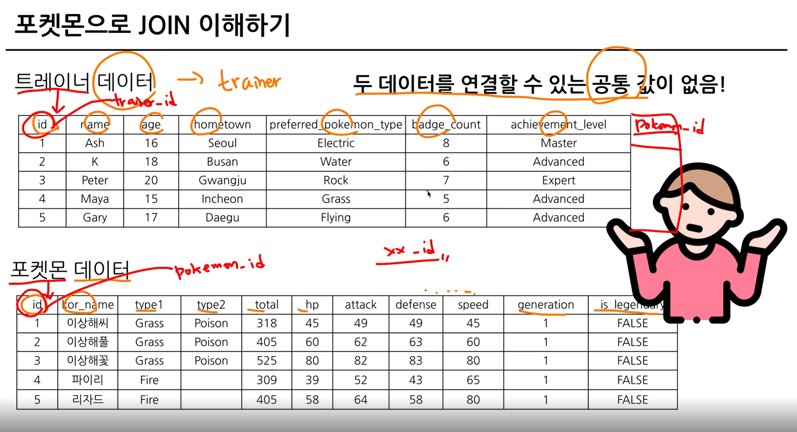
두 데이터를 연결할 수 없음.
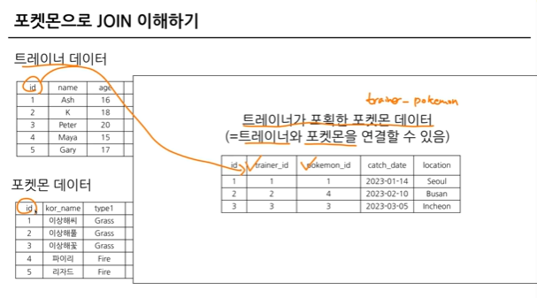
두 데이터를 연결할 수 있음.

-  트레이너가 포획한 포켓몬 기준으로 트레이너 데이터를 연결하기(JOIN)
   - 연결할 수 있는 key = trainer id, id
   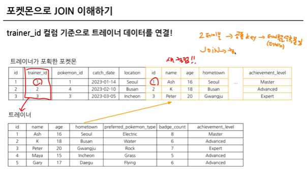
   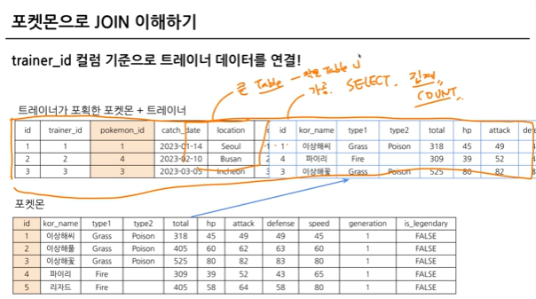
   공통적으로 존재하는 컬럼(=Key)이 있다면, JOIN 할 수 있음.\
   보통 id 값을 Key로 많이 사용하고, 특정 범위 (예 : Data)로 JOIN 가능함.\
   *JOIN이 어려운 것이 아니고 테이블 구조에 익숙하지 않아서 어려움을 느낄 확률이 높음.*
#### JOIN을 해야하는 이유
- 관계형 데이터베이스 설계시 정규화 과정을 거침.
  - 정규화는 중복을 최소화하게 데이터를 구조화.
  - User Table은 유저 데이터만, Order Table은 주문 데이터만.
  - 따라서 데이터를 다양한 Table에 저장해서 필요할 때 JOIN해서 사용.
- 데이터 분석하는 관점에선 미리 JOIN되어 있는 것이 좋을 수 있지만, 개발 관점에선 분리되어 있는 것이 좋음.
- 대신 데이터 웨어하우스에서 JOIN + 필요한 연산을 해서 "데이터 마트"를 만들어서 활용.

### 5-3. 다양한 JOIN 방법(LEFT, RIGHT, INNER, CROSS JOIN)

- (INNER)JOIN : 두 테이블의 공통 요소만 연결.
- LEFT/RIGHT (OUTER) JOIN : 왼쪽 / 오른쪽 테이블 기준으로 연결.
- FULL (OUTER) JOIN : 양쪽 기준으로 연결.
- CROSS JOIN : 두 테이블의 각각의 요소를 곱하기.

*처음에 어렵다면 LEFT JOIN만 주로 사용해도 충분*
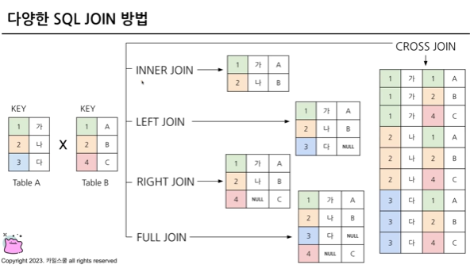

#### JOIN 집합 관점으로 생각하기


### 5-4. JOIN 쿼리 작성하기

#### SQL JOIN 쿼리 작성하는 흐름
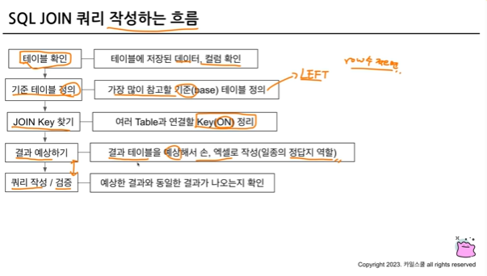
FROM 하단에 JOIN할 Table을 작성하고 ON 뒤에 공통된 컬럼(Key)를 작성.

```SQL
SELECT
 A.col1,
 A.col2,
 B.col11,
 B.col12
FROM table1 AS A
LEFT JOIN table2 AS B
ON A.key = B.key #Alias(별칭)를 사용할 수 있음.
```
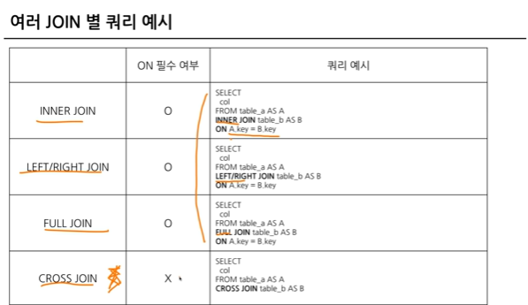
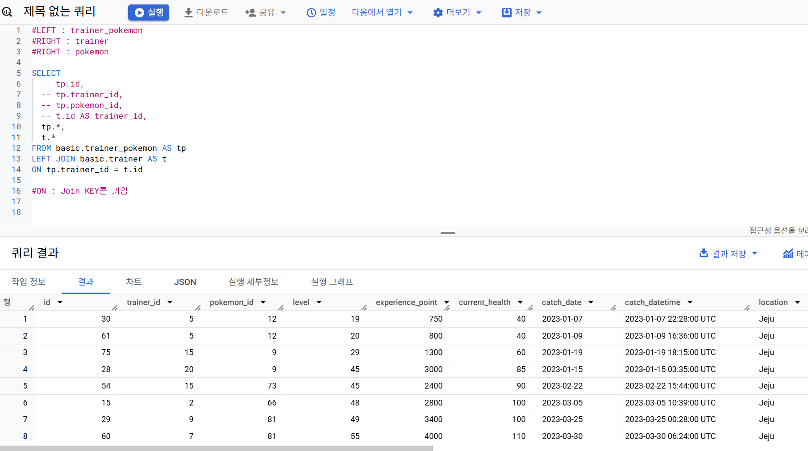
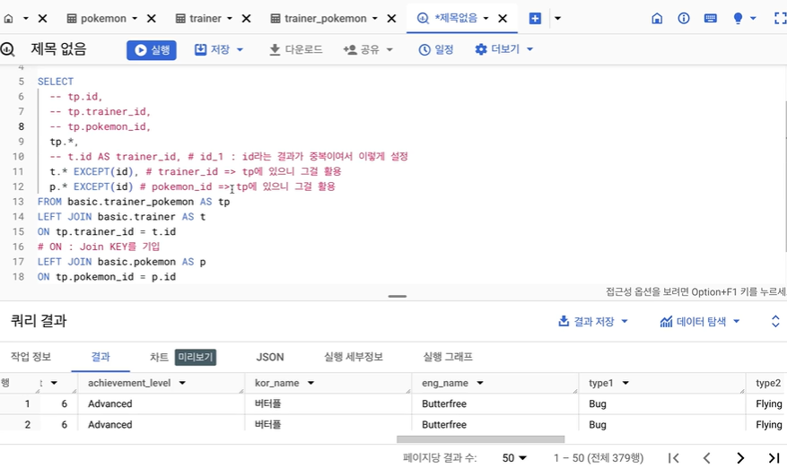

### 5-5. JOIN을 처음 공부할 때 헷갈렸던 부분

1) 여러 JOIN 중 어떤 것을 사용해야 할까?
    - 하려고 하는 작업의 목적에 따라 JOIN 선택해보기.
      - 교집합 : INNER
      - 모두 다 조합 : CROSS
      - 그게 아니라면 LEFT 또는 RIGHT : LEFT를 추천, 하나를 계속 활용하는 것을 추천.
    - 쿼리 작성 템플릿에 예상하는 결과를 작성하고, 중간 결과도 생각하면서 찾아보기.
2) 어떤 Table을 왼쪽에 두고, 어떤 Table이 오른쪽에 가야할까?
    - LEFT JOIN의 경우
      - 기준이 되는 Table을 왼쪽에 두기.
      - 기준에는 기준값이 존재하고, 우측에 데이터를 계속 추가.
3) 여러 Table을 연결할 수 있는걸까?
     - JOIN의 개수에 한계는 없음.
     - 너무 많이 JOIN하고 있는지 확인.
     ```SQL
     SELECT
       table_a.col1,
       table_b.col2
    FROM table_a
    LEFT JOIN table_b
    ON table_a.key = table_b.key

4) 컬럼은 모두 다 선택해야 할까?
    - 컬럼 선택은 데이터를 추출해서 무엇을 하고자?하냐에 따라 다름
    - JOIN이 잘 되었나 확인하기 위해 처음엔 많은 컬럼을 선택해도 괜찮으나, 사용하지 않을 컬럼은 선택하지 않은 것이 BigQuery에서 비용을 줄일 수 있음.
    - id같은 값은 Unique한지 확인하기 위해 자주 사용되므로 id는 자주 사용하는 편.
5) NULL이 대체 뭐죠?
    - NULL : 값이 없음, 알 수 없음.
    - 0이나 공백과 다르게 값이 아예 없는 것.
    - JOIN에선 연결할 값이 없는 경우 나타남.

### 5-6. JOIN 연습문제 1~2번
#### 1. 트레이너가 보유한 포켓몬들은 얼마나 있는지 알 수 있는 쿼리를 작성해주세요.(보유: status가 Active, Training, Released는 방출)
- 설명
```SQL
# 쿼리를 작성하는 목표, 확인할 지표 : 포켓몬들이(이름 명시) 얼마나 있는지 알고 싶다. 포켓몬의 수
# 쿼리 계산 방법 : trainer_pokemon + pokemon JOIN -> 그 후에 GROUP BY 집계 (COUNT)
# 데이터의 기간 : X
# 사용할 테이블: trainer_pokemon + pokemon
# Join KEY : trainer_pokemon.pokemon_id + pokemon.id
# 데이터 특징: 
-- 보유했다의 정의는 status가 active, training
-- released는 방출

# 1) trainer_pokemon에서 status가 Active, Training인 경우만 필터링(WHERE)
  -- 1)을 먼저 하는 것이 좋을까? 혹은 JOIN 이후 Active와 Training을 필터링하는 것이 좋을까?
  -- 연산량 관점에서 먼저 필터링 하는 것이 효율적
# 2) 필터링한 결과를 pokemon Table과 JOIN

SELECT
  tp.*,
  p.kor_name
FROM(
  SELECT
    id,
    trainer_id,
    pokemon_id,
    status
  FROM basic. trainer_pokemon
  WHERE
    status IN ("Active","Training")
) AS tp
LEFT JOIN basic.pokemon AS p
ON tp.pokemon_id = p.id;

# 3) 2)의 결과에서 pokemon_name, COUNT(pokemon_id) AS pokemon_cnt
```
- 정답
```SQL
SELECT
  p.kor_name,
  count(tp.id) AS pokemon_cnt
FROM(
  SELECT
    id,
    trainer_id,
    pokemon_id,
    status
  FROM basic. trainer_pokemon
  WHERE
    status IN ("Active","Training")
) AS tp
LEFT JOIN basic.pokemon AS p
ON tp.pokemon_id = p.id
GROUP BY
 kor_name
ORDER BY
 pokemon_cnt DESC;
 ```

- 순서 : SELECT FROM (JOIN - ON) WHERE GROUP BY
- WHERE 1 = 1 : 무조건 TRUE 반환 -> 모든 ROW를 출력.

```SQL
SELECT
  p.kor_name,
  count(tp.id) AS pokemon_cnt
FROM(
  SELECT
    id,
    trainer_id,
    pokemon_id,
    status
  FROM basic. trainer_pokemon
) AS tp
LEFT JOIN basic.pokemon AS p
ON tp.pokemon_id = p.id
WHERE
 1=1
 OR status = "Active"
 OR status = "Training"
GROUP BY
 kor_name
ORDER BY
 pokemon_cnt DESC;
 ```

 #### 2. 각 트레이너가 가진 포켓몬 중 'Grass' 타입의 포켓몬 수를 계산해주세요. (단, 편의를 위해 type1 기준으로 계산해주세요.)

```SQL
# 쿼리를 작성하는 목표, 확인할 지표 : 트레이너가 가지고 있는 포켓몬 중 Grass type의 수
# 쿼리 계산 방법 : 트레이너가 보유한 포켓몬 조건 설정 => Grass 타입으로 WHERE 조건 걸어서 COUNT
# 데이터의 기간 : X
# 사용할 테이블: trainer_pokemon + pokemon
  -- 우리가 풀려고 하는 문제에서 기준이 되는 테이블이 왼쪽
  -- pokemon을 왼쪽에 두면? pokemon 중에 보유되지 않았던 pokemon들은 trainer_pokemon에 없을 것이기 때문에 NULL
  -- trainer_pokemon을 왼쪽에 두면 트레이너가 보유했던 포켓몬들을 기준으로 포켓몬 데이터만 추가. NULL X
  -- JOIN을 할 수 있는 KEY가 많은 테이블을 왼쪽으로
# Join KEY : trainer_pokemon.pokemon_id + pokemon.id
# 데이터 특징: 
-- 타입은 type 1 기준으로
-- 보유했다의 정의는 status가 active, training
-- released는 방출
```

- 정답
```SQL
SELECT
  p.type1,
  count(p.id) AS pokemon_cnt
FROM(
  SELECT
  id,
  trainer_id,
  pokemon_id,
  status
FROM basic.trainer_pokemon
WHERE status IN ('Active', 'Training')
) AS tp
LEFT JOIN basic.pokemon AS p
ON tp.pokemon_id = p.id
WHERE 
  p.type1="Grass"
GROUP BY
  p.type1
ORDER BY
 2 DESC;
 ```
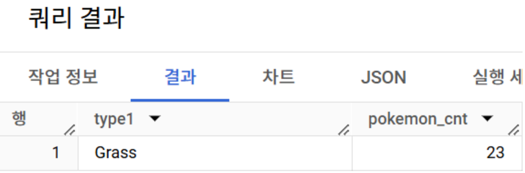

### 5-6. JOIN 연습 문제 3~5번

#### 3. 트레이너의 고향(hometown)과 포켓몬을 포획한 위치(location)을 비교하여, 자신의 고향에서 포켓몬을 포획한 트레이너의 수를 계산해주세요. (status와 상관없이 구해주세요.)
```SQL
# 쿼리를 작성하는 목표, 확인할 지표 : 트레이너 고향과 포켓몬의 포획 위치가 같은 트레이너의 수 계산
# 쿼리 계산 방법 : trainer(hometown),trainer_pokemon(location) JOIN -> hometown = location => 트레이너의 수 count
# 데이터의 기간 : X
# 사용할 테이블: trainer_pokemon + trainer
# Join KEY : trainer_pokemon.pokemon_id + trainer.id
# 데이터 특징: 
-- status 상관없이
```
- 정답 
```SQL
SELECT
  count(DISTINCT t.id) as cnt
  # count(t.id) as cnt : 트레이너와 포켓몬이 같은 건이 43개
FROM basic.trainer as t
LEFT JOIN basic.trainer_pokemon as tp
ON t.id = tp.trainer_id
WHERE
  t.hometown=tp.location
  and location IS NOT NULL
  -- trainer 중에 포켓몬을 잡아보지 못한 trainer가 있으면 NULL 조건을 걸어줘야 한다. 지금 데이터에는 trainer 테이블에 있는 trainer 들은 모두 포켓몬을 잡아봐서 신경 X
  ```
  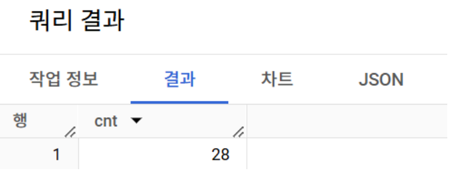

#### 4. Master 등급인 트레이너들은 어떤 타입의 포켓몬을 제일 많이 보유하고 있을까요?

```SQL
# 쿼리를 작성하는 목표, 확인할 지표 : Master 등급의 트레이너들이 가장 많이 보유하고 있는 타입
# 쿼리 계산 방법 : trainer + pokemon + trainer_pokemon => Master 조건 설정(WHERE) => type1 GROUP BY + COUNT
# 데이터의 기간 : X
# 사용할 테이블: trainer, pokemon trainer_pokemon
# Join KEY : trainer.id = trainer_pokemon.trainer_id, pokemon.id = trainer_pokemon.pokemon_id
 -- 2번 나오는 trainer_pokemon을 LEFT
# 데이터 특징: 
-- status: 보유
```
- 정답
```sql
SELECT
  p.type1,
  COUNT(tp.id) AS pokemon_cnt,
FROM (
  SELECT
    id,
    trainer_id,
    pokemon_id,
    status
  FROM basic.trainer_pokemon
  WHERE status IN ('Active', 'Training')
) AS tp
LEFT JOIN basic.trainer AS t
ON tp.trainer_id = t.id
LEFT JOIN basic.pokemon AS p
ON tp.pokemon_id = p.id
WHERE 
  t.achievement_level = 'Master'
GROUP BY
  p.type1
ORDER BY
  pokemon_cnt DESC;
```
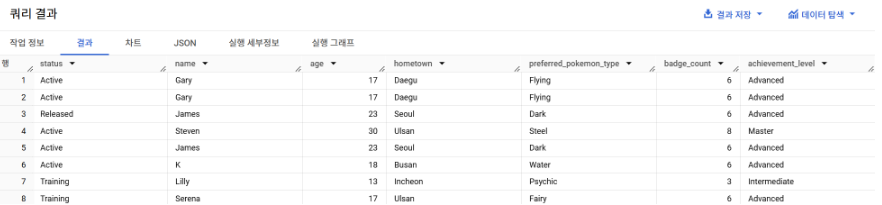

#### 5. Incheon 출신 트레이너들은 1세대, 2세대 포켓몬을 각각 얼마나 보유하고 있나요?
```SQL
# 쿼리를 작성하는 목표, 확인할 지표 :Incheon 출신의 트레이너들이 가장 많이 보유하고 있는 포켓몬을 세대구분하기
# 쿼리 계산 방법 : trainer + pokemon + trainer_pokemon => Incheon 조건 설정(WHERE) => 세대로 GROUP BY
# 데이터의 기간 : X
# 사용할 테이블: trainer, pokemon trainer_pokemon
# Join KEY : trainer.id = trainer_pokemon.trainer_id, pokemon.id = trainer_pokemon.pokemon_id
 -- 2번 나오는 trainer_pokemon을 LEFT
# 데이터 특징: 
-- status: 보유
```
- 정답 
```SQL
SELECT
generation,
COUNT(tp.id) AS pokemon_cnt
FROM(
  SELECT
    id,
    trainer_id,
    pokemon_id,
    status
  FROM basic.trainer_pokemon
  WHERE status IN ('Active', 'Training')
) AS tp
LEFT JOIN basic.trainer AS t
ON tp.trainer_id = t.id
LEFT JOIN basic.pokemon AS p
ON tp.pokemon_id = p.id
WHERE
  t.hometown = 'Incheon'
GROUP BY
generation;
```

### 5-7. 정리
#### JOIN 정리
- JOIN : 여러 Table을 연결해야 할 떄 사용하는 문법
- Key : 공통적으로 가지고 있는 컬럼

<수강 인증>
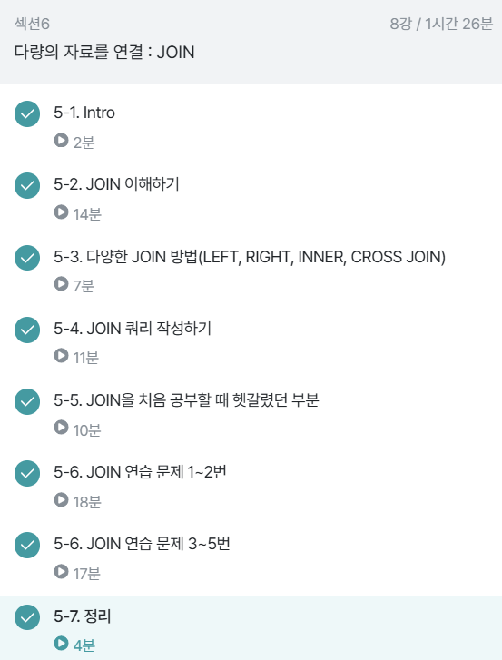