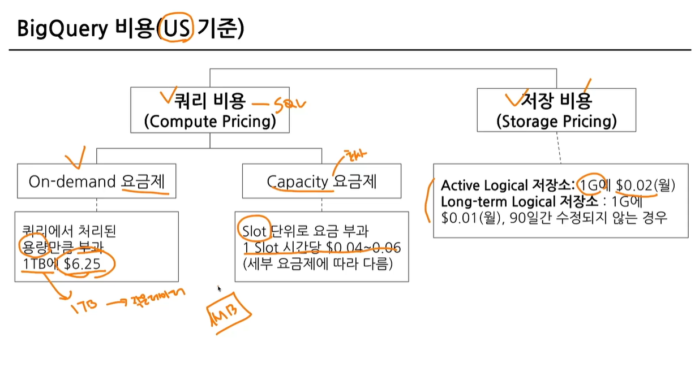

## 섹션7. 데이터 결과 검증, 가독성 있는 쿼리 작성하기
### 6-1. Intro
#### 이번 파트에서 다룰 내용
- 가독성을 챙기기 위한 SQL 스타일 가이드.
- 데이터 결과 검증.
- 데이터 결과 검증 예시.

### 6-2. 가독성을 챙기기 위한 SQL 스타일 가이드
#### 데이터 결과 검증을 하기 전에 
실수는 언제 발생하는가?
- 문법을 잘못 알고 있는 경우.
- 데이터를 파악하지 않고 쿼리를 작성하는 경우.
- 쿼리가 복잡한 경우
다른 사람의 쿼리를 봐야하는 경우 또는 내 쿼리를 다른 사람이 보는 경우.
- 쿼리를 가독성 있게 잘 작성했으면 별도의 설명이 없어도 이해할 가능성이 존재
- 매번 설명을 해야하면, 이 쿼리를 보는 사람들이 많아질수록 내 시간을 쓰게 됨.
- 쿼리를 변경해야 할 경우에 특정 부분만 바꿨는지, 전체를 바꿨는지도 파악하는 것이 쉬우면 좋음.

#### 1. 예약어는 대문자로 작성
SQL에서 문법적인 용도로 사용하고 있는 문자들은 대문자로 작성.
(SELCET, FROM, WHERE, 각종 함수) 

#### 2. 컬럼 이름은 snake_case로 작성
컬럼 이름은 CamelCase가 아닌snake_case로 작성 .(회사 기준이 CamelCase면 사용. 일관성이 중요)

#### 3. 명시적 vs 암시적인 이름
Alias로 별칭을 지을 때는 명시적인 이름을 적용.\
AS a, AS b 등 컬럼의 의미를 한번 더 생각하게 하는 이름이 아닌 명시적인 것을 사용.\
JOIN 할 때 테이블의 이름도 명시적으로 할 수 있다면 명시적으로 진행하기.\
AS를 생략해서 별칭을 설정할 수도 있는데, AS를 쓰는 것도 명시적인 표현.

#### 4. 왼쪽 정렬
기본적으로 왼쪽 정렬을 기준으로 작성.

#### 5. 예약어나 컬럼은 한 줄에 하나씩 권장
컬럼은 바로 주석처리할 수 있는 장점이 있기에 한 줄에 하나씩 작성.

#### 6. 쉼표는 컬럼 바로 뒤에
의견이 갈리는 부분. 쉼표 앞 vs 뒤. BigQuery는 마지막 쉼표를 무시해서 뒤에 작성해도 무방.

### 6-3. 가독성을 챙기기 위한 WITH문 & 파티션
#### WITH 구문
SQL 쿼리를 작성하다 생기는 일 => 점점 복잡해짐(가독성 하락)
- 만약 아래 쿼리가 다른 곳에서도 필요하면 복사 붙여넣기
```SQL
SELECT
  col, col2
FROM(
  SELECT
    col, col2, col3
  FORM
    Table
)
```
WITH 문을 사용해 쿼리를 정의해서 재사용 가능
```SQL
WITH temp_table AS(
    SELECT
      col, col2, col3
    FROM
      Table
)
SELECT
  col, col2
FROM temp_table
```
- CTE(Common Table Expression)라고 표현.
- SELECT 구문에 이름을 정해주는 것과 유사.
- 쿼리 내에서 반복적으로 사용할 수 있음.

#### PARTITION
Table엔 Partition이란 것이 존재할 수 있음.

#### PARTITION을 사용하면 좋은 점
- 쿼리 성능 향상
  - 전체 데이터를 스캔하는 것보다 파티션을 설정한 곳만 스캔하는 것이 더 빠름.
- 데이터 관리 용이성
  - 특정 일자의 데이터를 모두 변경하거나 삭제해야 하면 파티션을 설정해서 삭제할 수 있음.
- 비용
  - 파티션에 해당되는 데이터만 스캔해서 비용을 줄일 수 있음. (BigQuery는 쿼리 용량에 비례해서 과금)


### 6-4. 데이터 결과 검증 정의
#### 카일스토리
데이터 직무라면 한번쯤 경험할 수 있는 이야기.
- 갑작스럽게 데이터 추출을 해야하는 상황에 빠르게 데이터를 추출 후 공유.
- 데이터를 공유한 후, 혹시나 싶어 확인해보니 오류가 있었음.
- 데이터를 다시 공유하면서 정정 => 데이터 결과 검증을 어떻게 할 수 있을까?에 대한 이야기.
##### SQL 강의에서 데이터 결과 검증에 대한 내용을 다루는 곳은 거의 없음.

#### 데이터 결과 검증을 잘하기 위한 마인드셋 
데이터 결과 검증을 하지 못해서 실수할 수 있음. 실수가 반복되는 것은 문제. 항상 그 실수 이후에 어떻게 해야 다시 반복되지 않을지 생각하는 것이 필요.

#### 데이터 결과 검증의 정의


#### 데이터 결과를 검증하는 흐름


#### 데이터 결과 검증할 때 자주 활용하는 SQL 쿼리
- COUNT(*) : 행 수를 확인. 의도한 데이터의 행 개수가 맞는가?
- NOT NULL : 특정 컬럼에 NULL이 존재하는가? 필수 필드가 비어있지 않는가?
- DISTINCT : 데이터의 고유값을 확인해 중복 여부 확인.
- IF문, CASE WHEN : 의도와 같다면 TRUE, 아니면 FALSE

#### 제가 데이터 결과 검증을 할 때 활용하는 방식
- 특정 user_id로 필터링을 걸어서 확인.
  - 1명의 데이터 확인(예 : WHERE user_id = 402)
  - 결과를 예상할 때 Raw 데이터에서 하나씩 눈으로 세고 적어둠.(예상 결과)
  - 1명의 데이터의 예상 결과와 쿼리 결과가 동일한지 확인
  - 다른 user_id 3~4건 더 추가해서 확인(여러 케이스 존재할 수 있음)
  - 3~4개에서 동일한 결과가 나오면 user_id 조건을 삭제
- 샘플데이터 생성하기
  - WITH문을 사용해 예시 데이터를 생성한 후, 결과를 예상하고 쿼리 작성.
  - 복잡한 데이터에서 하기 전에, 쿼리 자체가 올바른지 확인할 때 주로 사용.

### 6-5. 데이터 결과 검증 예시
#### 데이터 결과 검증 예시 문제


### 6-6. 정리

<수강 인증>
