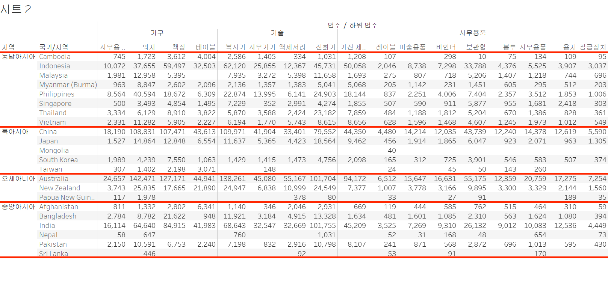
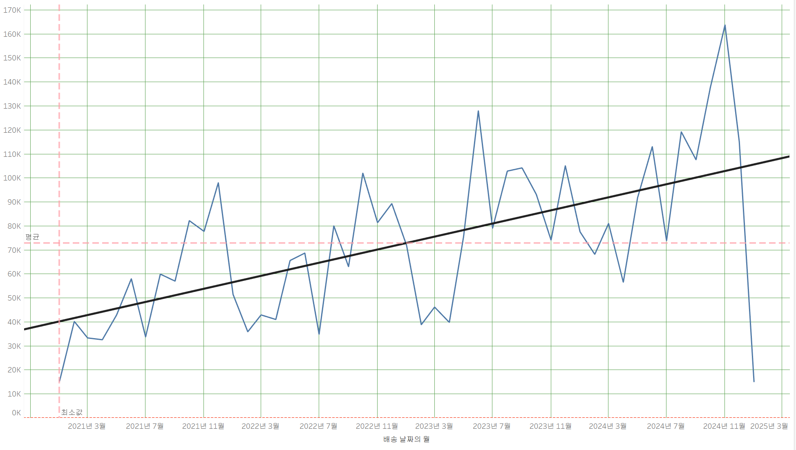

# Sixth Study Week


## Study Schedule
<br>

| 회차 | 강의 범위   | 강의 이수 여부 | 링크                                                                                                     |
|------|-------------|----------------|--------------------------------------------------------------------------------------------------------|
| 1    | 1~7강       | ✅              | [링크](https://www.youtube.com/watch?v=AXkaUrJs-Ko&list=PL87tgIIryGsa5vdz6MsaOEF8PK-YqK3fz&index=84)    |
| 2    | 8~17강      | ✅              | [링크](https://www.youtube.com/watch?v=AXkaUrJs-Ko&list=PL87tgIIryGsa5vdz6MsaOEF8PK-YqK3fz&index=75)    |
| 3    | 18~27강     | ✅              | [링크](https://www.youtube.com/watch?v=AXkaUrJs-Ko&list=PL87tgIIryGsa5vdz6MsaOEF8PK-YqK3fz&index=65)    |
| 4    | 28~37강     | ✅              | [링크](https://www.youtube.com/watch?v=e6J0Ljd6h44&list=PL87tgIIryGsa5vdz6MsaOEF8PK-YqK3fz&index=55)    |
| 5    | 38~47강     | ✅              | [링크](https://www.youtube.com/watch?v=AXkaUrJs-Ko&list=PL87tgIIryGsa5vdz6MsaOEF8PK-YqK3fz&index=45)    |
| 6    | 48~57강     | ✅              | [링크](https://www.youtube.com/watch?v=AXkaUrJs-Ko&list=PL87tgIIryGsa5vdz6MsaOEF8PK-YqK3fz&index=35)    |
| 7    | 58~67강     | 🍽️             | [링크](https://www.youtube.com/watch?v=AXkaUrJs-Ko&list=PL87tgIIryGsa5vdz6MsaOEF8PK-YqK3fz&index=25)    |
| 8    | 68~77강     | 🍽️             | [링크](https://www.youtube.com/watch?v=AXkaUrJs-Ko&list=PL87tgIIryGsa5vdz6MsaOEF8PK-YqK3fz&index=15)    |
| 9    | 78~85강     | 🍽️             | [링크](https://www.youtube.com/watch?v=AXkaUrJs-Ko&list=PL87tgIIryGsa5vdz6MsaOEF8PK-YqK3fz&index=5)     |
---

<br/>
<!-- 여기까진 그대로 둬 주세요-->

> **🧞‍♀️ 오늘은 강의보다 실습과 대시보드 직접 만들기가 더 중요하니, 기록보다는 사고하며 강의를 들어주세요.**

## 48. 워크시트 서식(2)

<!-- 워크시트에 관해 본 강의에서 알게 된 점을 적어주세요 -->

[서식]-[테두리]

수준 : 구분의 정도

테두리와 라인의 차이 : 데이터를 기준으로 구분할 수 있음. 
  - 테두리 서식 : 뷰에서 테이블, 패널, 셀 및 머리글을 둘러싸는 
 
  라인의 서식을 설정함. 
  - 라인 서식 : 뷰에서 표시된 데이터의 축에 대한 라인의 모양을 설정. 


## 49강. 대시보드패널

<!-- 대시보드패널 강의에서 알게 된 점을 적어주세요. -->
대시보드 디자인 페이지는 각 시트와 개체들을 배치할 수 있는 공간임.

## 50. 대시보드 구성방식

<!-- 알게 된 점을 적고, 아래 질문에 답해보세요 :) -->
개체를 추가하는 구성 방식
  - 바둑판식
  대시보드의 크기가 자주 변경되는 경우에 개체를 추가하면 바둑판식을 사용하는 것을 추천. 
  바둑판식으로 개체들을 추가하면 대시보드 크기를 변경해도 개체가 유사한 형식을 유지함.
  - 부동식
  부동 개체는 대시보드 크기가 자주 변동되지 않는 경우에 사용하는 것이 좋음. 

> **🧞‍♀️ 부동과 바둑판식 방식을 차이를 중점으로 기술해보세요**

바둑판식은 시트를 추가하는 순간 시트들의 위치가 바뀌지만, 부동식은 추가해도 원래의 시트들의 위치는 바뀌지 않음. 

## 51. 대시보드 컨테이너
컨테이너 : 대시보드 개체들과 워크시트들을 그룹화하고 구성할 수 있는 공간.
  - 가로 컨테이너 
  내부의 개체들을 수평 공간으로 배열할 때 사용.
  - 내부의 개체들을 수직 공간으로 배열할 때 사용함. 

## 52. 레이아웃 패널
- 제목 표시: 제목 표시 여부 결정
- 부동: 개체를 부동 개체로 변경 가능, 옵션 해제시 원래 위치로 돌아가지 않는 점 주의
- 위치와 크기: 부동 개체만 변경 가능, 픽셀 단위로 변경
- 테두리 옵션: 테두리 선 종류, 굵기, 색상 조정
  - 바깥족 여백: 컨테이너의 모서리와 테두리 사이의 공간 조절
  - 안쪽 여백:선택된 개체 모러시와 테두리 사이의 공간 조절
- 백그라운드: 선택하는 컨테이너의 색상을 변경

## 53. 필터 동작

<!-- 필터 동작에 대해 알게 된 점을 적어주세요 -->
- 필터를 추가하는 방법
  1. 차트>드롭다운 메뉴>필터
  2. 차트를 선택하고, "필터로 사용" 기호를 클릭

- 각각의 워크시트들이 서로 연계되어 표현을 하기 위해서는 대시보드 동작 추가 필요함.

## 54. 대시보드 하이라이터 동작

<!-- 하이라이터에 대해 알게 된 점을 적어주세요 -->
- 대시보드 하이라이트 동작이 작동하려면 선택 기준으로 사용하는 필드가 변경할 그래프에 포함되어 있어야 함.

## 55. 대시보드 URL

<!-- URL에 대해 알게 된 점을 적어주세요 -->
- 웹사이트 동작 기능을 만들기 위해서는 URL로 이동 동작 설정 필요
- 웹 페이지 개체를 통해 대시보드 안에 웹 페이지 띄우기
- ALT 키 누른 상태에서 단추 클릭하면 원래 대시보드로 돌아감
## 56. 대시보드 시트에 이동 동작

<!-- 대시보드 시트에 이동에 대해 알게 된 점을 적어주세요!-->
- 대시보드 동작 기능을 활용해 다른 대시보드로 이동

- 탐색 버튼을 통해 원 대시보드로 돌아가기 
## 57. 매개변수 변경 동작

<!-- 매개변수 변경 동작에 대해 알게 된 점을 적어주세요!-->
- 주문 날짜의 연속형 월 필드가 시작 날짜 매개 변수보다 크거나 같고 끝 날짜 매개 변수보다 작거나 같을 때 데이터를 라인 그래프로 표현

## 문제

오늘은 별도의 문제가 없습니다. 


여러 대시보드를 참고하시어, superstore 데이터를 사용해 나만의 대시보드를 제작해주세요.

**단, 워크시트 3개 이상의 그래프를 표시해야 하며 각 시트 간 상호작용성 필터 or 하이라이트 동작은 꼭 추가되어야 합니다**


```
맵에 매개 변수를 적용해 매출, 수익, 수량 차원을 시각화 해 나타냈으며, 매출과 수익을 그래프로 나타내 한 눈에 보여주고자 했습니다. 트리맵과, 워드 클라우드에 하이라이트 동작을 설정해 연동시켜 어느 범주가 가장 많은 매출을 기록했는지 보여주고자 했습니다!
```


어떤 부분에 가중을 두었는지, 어떤 사용자 편의성을 고려하였는지에 대한 설명이 필요합니다.
